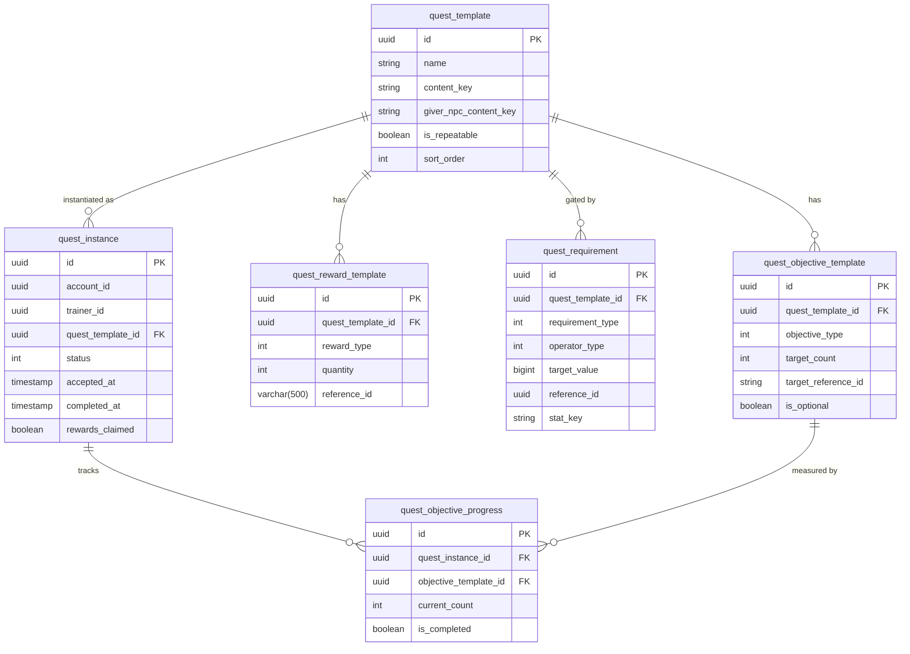

# Quest System

Quests are the primary structured progression mechanism in Crystalline Rift. The system separates read-only template data (content) from mutable instance data (player state), evaluates gating requirements, tracks per-objective progress, and writes lifetime stats as a side-effect of every progress event.

## Why This Design?

### Why Separate Templates from Instances?

A quest template is content — defined once by a designer, shared across all trainers. A quest instance is state — one trainer's active or completed run of that template. Keeping them in separate tables means the template table is essentially read-only after shipping content, and all write pressure goes to the instance and progress tables where it belongs.

This mirrors the Class/Object relationship: `quest_template` is the class, `quest_instance` is the object. The same template can produce many instances (for repeatable quests, one per repeat), each with its own accept time, progress counters, and reward state.

### Why `content_key` on Templates?

Quest templates carry a `content_key` (e.g. `"quest_talk_to_elder"`) for the same reason NPCs and spawners do — it bridges the backend database to Unity's `QuestDefinition` ScriptableObjects. The Unity client references quests by `content_key` to resolve display names, descriptions, and objective data from SOs without a live database read. `content_key` is globally unique across all quest templates.

The `giver_npc_content_key` column links a template to the NPC that offers it, using the same string key that appears on the NPC's `content_key` column. When a player opens an NPC's quest list, the client calls `GetAvailableQuestsForTrainerAsync(accountId, trainerId, npcContentKey, ct)` — the backend filters `quest_template.giver_npc_content_key = npcContentKey` to return only that NPC's quests.

### Why AND Logic for Requirements (No OR)?

Requirement evaluation uses strict AND semantics — all rows in `quest_requirement` for a given template must pass for the quest to become available. This covers the vast majority of gating scenarios (reach level X, complete quest Y, have item Z) while keeping `IConditionEvaluator` simple and deterministic. OR logic creates combinatorial evaluation paths that are harder to debug and harder for designers to reason about. If OR-style gating is needed, express it as separate quest templates gating a third template rather than OR rows in the same requirement list.

### Why Do Stat Writes Happen in the Quest Domain?

The Stats domain tracks lifetime career totals. The Quest domain is the subsystem that knows a meaningful player action occurred (a battle was won, a creature was captured). Rather than requiring the battle system or capture system to know about the Stats domain directly, `RecordProgressEventAsync` is the chokepoint — every action that advances a quest objective also represents a trackable career event. This avoids a dependency on Stats from every other domain and gives quest progress and stat writes the same transactional scope.

## Data Model



For full column descriptions see the table breakdowns in the sections below.

## How to Define a New Quest (Step-by-Step)

### Step 1: Create the migration

Name the migration file with the next migration number and a descriptive suffix:

```csharp
[Migration(7010)]
public class M7010_AddBattleTrialQuest : FluentMigrator.Migration
{
    private const string TemplateId    = "11111111-0000-0000-0000-000000000001";
    private const string Objective1Id  = "22222222-0000-0000-0000-000000000001";
    private const string RewardId      = "33333333-0000-0000-0000-000000000001";

    public override void Up()
    {
        var isSqlite = ConnectionString.ToLower().Contains("data source") ||
                       ConnectionString.ToLower().Contains("sqlite");

        if (isSqlite)
        {
            Execute.Sql($@"
                INSERT OR IGNORE INTO quest_template
                  (id, name, description, content_id, content_key, giver_npc_content_key,
                   is_repeatable, max_repeat_count, sort_order, deleted, created_at, updated_at)
                VALUES
                  ('{TemplateId}', 'Battle Trial', 'Win 3 battles to prove your worth.',
                   '{TemplateId}', 'quest_battle_trial', 'kael_trainer_npc',
                   0, 0, 10, 0, datetime('now'), datetime('now'))
            ");
            Execute.Sql($@"
                INSERT OR IGNORE INTO quest_objective_template
                  (id, quest_template_id, objective_type, description,
                   target_count, target_reference_id, target_metadata,
                   is_optional, sort_order, deleted, created_at, updated_at)
                VALUES
                  ('{Objective1Id}', '{TemplateId}', 3, 'Win 3 battles',
                   3, NULL, NULL,
                   0, 1, 0, datetime('now'), datetime('now'))
            ");
        }
        else
        {
            Execute.Sql($@"
                INSERT INTO quest_template
                  (id, name, description, content_id, content_key, giver_npc_content_key,
                   is_repeatable, max_repeat_count, sort_order, deleted, created_at, updated_at)
                VALUES
                  ('{TemplateId}', 'Battle Trial', 'Win 3 battles to prove your worth.',
                   '{TemplateId}', 'quest_battle_trial', 'kael_trainer_npc',
                   false, 0, 10, false, now(), now())
                ON CONFLICT (id) DO NOTHING
            ");
            Execute.Sql($@"
                INSERT INTO quest_objective_template
                  (id, quest_template_id, objective_type, description,
                   target_count, target_reference_id, target_metadata,
                   is_optional, sort_order, deleted, created_at, updated_at)
                VALUES
                  ('{Objective1Id}', '{TemplateId}', 3, 'Win 3 battles',
                   3, NULL, NULL,
                   false, 1, false, now(), now())
                ON CONFLICT (id) DO NOTHING
            ");
        }
    }

    public override void Down()
    {
        Execute.Sql($"DELETE FROM quest_objective_template WHERE quest_template_id = '{TemplateId}'");
        Execute.Sql($"DELETE FROM quest_template WHERE id = '{TemplateId}'");
    }
}
```

Key points:
- `objective_type` = 3 is `WinBattles` (see enum table below)
- `target_count` = 3 means the player must win 3 battles
- `giver_npc_content_key` must match the `content_key` of an existing NPC or be `NULL` for world quests
- Use `0`/`false` for booleans (engine-aware as shown)
- Always provide a `Down()` that cleans up seed data

### Step 2: Create a `QuestDefinition` ScriptableObject in Unity

In the Unity editor, right-click in the Project window and select **Create → CR → Quest Definition**. Fill in the inspector fields:

| Field | Value |
|-------|-------|
| `contentKey` | `"quest_battle_trial"` — must match the migration exactly |
| `questName` | `"Battle Trial"` |
| `description` | `"Win 3 battles to prove your worth."` |
| `giverNpcContentKey` | `"kael_trainer_npc"` |
| `isRepeatable` | false |
| `objectives[0].objectiveType` | `WinBattles` |
| `objectives[0].description` | `"Win 3 battles"` |
| `objectives[0].targetCount` | 3 |

The SO is the Unity-side source of truth for display data. The `content_key` must match the database row exactly. Use the **Sync to Backend** button in the inspector to push the template to the server via `PUT /api/v1/quests/templates/bulk` rather than writing a separate migration for the template row — the migration is only needed for seed data in environments without the editor.

### Step 3: Add a requirement (optional)

To gate the quest behind another quest being completed:

```sql
-- Postgres
INSERT INTO quest_requirement
  (id, quest_template_id, requirement_type, operator_type,
   target_value, reference_id, stat_key, deleted, created_at, updated_at)
VALUES
  (gen_random_uuid(), '<TemplateId>', 0, 0,
   1, '<PrecedingQuestTemplateId>', NULL, false, now(), now());
-- requirement_type 0 = QuestCompleted, operator_type 0 = GreaterThanOrEqual, target_value 1 = at least 1 completion
```

## How to Advance a Quest Objective from Unity

The Unity client calls `POST /api/v1/quests/progress` after any game event that might satisfy an objective. The call should be fire-and-forget from the game logic perspective — it records the event and the backend handles matching it against active quests.

```csharp
// In the battle system, after a win
await _questClient.RecordProgressAsync(new QuestProgressRequest
{
    AccountId    = _session.AccountId,
    TrainerId    = _session.TrainerId,
    ObjectiveType = QuestObjectiveType.WinBattles,   // int value 3
    Amount        = 1,
    ReferenceId   = null,   // not needed for WinBattles
});
```

The HTTP call:

```bash
curl -s -X POST http://localhost:5000/api/v1/quests/progress \
  -H "Authorization: Bearer $TOKEN" \
  -H "Content-Type: application/json" \
  -d '{
    "accountId":     "aaaaaaaa-...",
    "trainerId":     "bbbbbbbb-...",
    "objectiveType": 3,
    "amount":        1,
    "referenceId":   null
  }'
```

Response:
```json
{
  "updatedInstances": [
    {
      "instanceId": "cccccccc-...",
      "newStatus":  "InProgress",
      "objectives": [
        {
          "objectiveTemplateId": "22222222-...",
          "currentCount": 1,
          "targetCount":  3,
          "isCompleted":  false
        }
      ]
    }
  ]
}
```

If the third win occurs, `newStatus` becomes `"Completed"` and `isCompleted` becomes `true`. The Unity client inspects `newStatus` to trigger the quest-complete celebration animation and enable the reward claim button.

The same `RecordProgressEventAsync` call also writes the `battles_won` lifetime stat regardless of whether any quest matched.

## Quest Lifecycle

```
Available
  │  AcceptQuestAsync
  ▼
InProgress
  │  RecordProgressEventAsync (auto-transitions when all required objectives complete)
  ▼
Completed ─── ClaimRewardsAsync ──► rewards_claimed = true
  │
  │  (also valid from InProgress)
  ▼
Abandoned  (AbandonQuestAsync)
```

**Available** — a quest is available when:
- The trainer has no active (InProgress) instance of this template
- The template is not already completed, OR `is_repeatable = true` and `repeat_number < max_repeat_count` (or `max_repeat_count = 0`)
- All `quest_requirement` rows evaluate to true (AND logic); if there are no requirement rows the quest is ungated

**InProgress** — created by `AcceptQuestAsync`. A matching `quest_objective_progress` row is created for every non-deleted objective template at accept time.

**Completed** — `RecordProgressEventAsync` increments matching progress rows, then checks whether every non-optional objective has `is_completed = true`. If so, the instance status transitions to `Completed` automatically.

**Claimed** — `ClaimRewardsAsync` sets `rewards_claimed = true` and increments the `quests_completed` lifetime stat. Double-claim throws.

**Abandoned** — `AbandonQuestAsync` sets status to `Abandoned`. Instance is retained for audit.

### Repeatable Quest Reset

When `is_repeatable = true`, a trainer can accept the same template again after completing it:

1. Trainer completes run 1 → instance `repeat_number = 1`, status = Completed
2. `ClaimRewardsAsync` sets `rewards_claimed = true`
3. The template reappears in `GetAvailableQuestsForTrainerAsync` because no active instance exists and the template is repeatable
4. Trainer accepts again → new instance created with `repeat_number = 2`
5. **Progress rows start at 0 for the new instance** — the previous instance's progress is not carried over

**What fields are cleared:** The old `quest_instance` is not modified — it is left as Completed/claimed as an audit record. A new `quest_instance` row is created with `repeat_number` incremented. The old `quest_objective_progress` rows belong to the old instance and are left untouched. New progress rows start at `current_count = 0`.

`max_repeat_count = 0` means unlimited repeats. Once the cap is reached, the template is excluded from available quests.

## Enums

### `QuestObjectiveType`

| Value | Int | Description |
|-------|-----|-------------|
| `DefeatCreature` | 0 | Defeat a specific creature (matched by `target_reference_id`) |
| `DefeatAnyCreature` | 1 | Defeat any creature; `target_reference_id` is ignored |
| `DealDamageOfType` | 2 | Deal damage using a specific type; `target_reference_id` = damage type |
| `WinBattles` | 3 | Win any battle encounters |
| `CaptureCreature` | 4 | Capture a specific creature (matched by `target_reference_id`) |
| `CaptureAnyCreature` | 5 | Capture any creature; `target_reference_id` is ignored |
| `DealDamage` | 6 | Deal any amount of damage |
| `HealAmount` | 7 | Heal any amount |
| `ReachCreatureLevel` | 8 | Raise a creature to a specific level |
| `VisitLocation` | 10 | Travel to a named location |
| `TalkToNpc` | 11 | Interact with a specific NPC |
| `CollectItem` | 20 | Collect a specific item |
| `CompleteQuest` | 30 | Complete another quest (used for chain objectives) |

### `QuestRequirementType`

| Value | Int | Evaluated by |
|-------|-----|--------------|
| `QuestCompleted` | 0 | Checks `quest_instance` for a completed run of `reference_id` |
| `StatThreshold` | 1 | Reads `stat_key` from `IStatService`, applies `operator_type` vs `target_value` |
| `HasItem` | 2 | Sums item quantities across all trainer inventories where `BaseItemId == reference_id` |
| `CreatureLevel` | 3 | If `reference_id` set: stat `creature_level_{id}`; else `highest_creature_level` |
| `TrainerLevel` | 4 | Reads stat `trainer_level`, applies `operator_type` vs `target_value` |

### `RequirementOperator`

| Value | Int |
|-------|-----|
| `GreaterThanOrEqual` | 0 |
| `LessThanOrEqual` | 1 |
| `Equal` | 2 |

## Domain Service Interface

Source: `Quests/CR.Quests.Domain.Services/Interface/IQuestDomainService.cs`

```csharp
Task<QuestTemplate?> GetQuestTemplateAsync(Guid templateId, CancellationToken ct);

Task<IReadOnlyList<QuestTemplate>> GetAvailableQuestsForTrainerAsync(
    Guid accountId, Guid trainerId, string? giverNpcContentKey, CancellationToken ct);

Task<IReadOnlyList<QuestInstance>> GetActiveQuestsAsync(
    Guid accountId, Guid trainerId, CancellationToken ct);

Task<QuestInstance?> GetQuestInstanceAsync(
    Guid accountId, Guid trainerId, Guid instanceId, CancellationToken ct);

Task<QuestInstance> AcceptQuestAsync(
    Guid accountId, Guid trainerId, Guid templateId, CancellationToken ct);

Task AbandonQuestAsync(
    Guid accountId, Guid trainerId, Guid instanceId, CancellationToken ct);

Task<QuestProgressResult> RecordProgressEventAsync(
    Guid accountId, Guid trainerId, QuestProgressEvent evt, CancellationToken ct);

Task<QuestInstance> ClaimRewardsAsync(
    Guid accountId, Guid trainerId, Guid instanceId, CancellationToken ct);
```

### `QuestProgressEvent`

```csharp
public class QuestProgressEvent
{
    public QuestObjectiveType ObjectiveType { get; set; }
    public int Amount { get; set; }
    public string? ReferenceId { get; set; }  // content key: creature, item, location, etc.
}
```

### Stat Side-Effects of `RecordProgressEventAsync`

Every progress event also increments a lifetime stat regardless of whether any quest objective matched:

| ObjectiveType | Stat written | Operator |
|---------------|-------------|---------|
| `WinBattles` | `battles_won` | Increment |
| `DefeatCreature`, `DefeatAnyCreature` | `creatures_defeated_total` | Increment |
| `CaptureCreature`, `CaptureAnyCreature` | `creatures_captured_total` | Increment |
| `DealDamage`, `DealDamageOfType` | `damage_dealt_total` | Increment |
| `HealAmount` | `damage_healed_total` | Increment |
| `CollectItem` | `items_collected_total` | Increment |
| `ReachCreatureLevel` | `creature_level_{referenceId}` (content key) AND `highest_creature_level` | Max |

Quest-scoped progress resets with each instance. Lifetime stats never reset.

## Condition Evaluator

`IConditionEvaluator` is used internally by `GetAvailableQuestsForTrainerAsync` to gate quest availability:

```csharp
// Short-circuits on first failure. Used as the accept gate — cheap and authoritative.
Task<bool> EvaluateAllAsync(
    IReadOnlyList<QuestRequirement> requirements,
    Guid accountId, Guid trainerId, CancellationToken ct);

// Evaluates every requirement individually. Never short-circuits.
// Returns a RequirementCheckResult per row — use for locked-quest preview UI.
Task<IReadOnlyList<RequirementCheckResult>> EvaluateEachAsync(
    IReadOnlyList<QuestRequirement> requirements,
    Guid accountId, Guid trainerId, CancellationToken ct);
```

`EvaluateEachAsync` is for client-side "locked quest" previews — the trainer sees a quest they cannot yet accept, with each unmet requirement highlighted (e.g. "Complete quest X", "Reach trainer level 5"). Do **not** use it as the accept gate; use `EvaluateAllAsync` there.

`RequirementCheckResult` pairs the original `QuestRequirement` with a `bool Met` flag, giving the caller full context to render requirement state without a second lookup.

## REST Endpoints

All quest endpoints are prefixed `/api/v1/quests`.

| Method | Path | Description |
|--------|------|-------------|
| `GET` | `/api/v1/quests/available` | List available quest templates for a trainer |
| `GET` | `/api/v1/quests/active` | List InProgress quest instances for a trainer |
| `GET` | `/api/v1/quests/{instanceId}` | Get a specific quest instance by ID |
| `POST` | `/api/v1/quests/accept` | Accept a quest and create an instance |
| `POST` | `/api/v1/quests/abandon` | Abandon an active quest instance |
| `POST` | `/api/v1/quests/progress` | Record a progress event against active quests |
| `POST` | `/api/v1/quests/claim` | Claim rewards for a completed quest |
| `PUT` | `/api/v1/quests/templates/bulk` | Bulk create-or-update quest templates by `content_key` (Content Studio sync) |

### Query parameters (GET endpoints)

`GET /api/v1/quests/available?accountId=&trainerId=&npcContentKey=`

`npcContentKey` is optional. When supplied, only quests with a matching `giver_npc_content_key` are returned. When omitted, all available quests for the trainer are returned.

### Request/response examples

```json
POST /api/v1/quests/accept
{
  "accountId":  "00000000-...",
  "trainerId":  "00000000-...",
  "templateId": "11111111-0000-0000-0000-000000000001"
}

→ 200 OK  (QuestInstance)
{
  "instanceId":    "cccccccc-...",
  "templateId":    "11111111-...",
  "status":        "InProgress",
  "acceptedAt":    "2026-03-13T10:00:00Z",
  "objectives": [
    { "objectiveTemplateId": "22222222-...", "currentCount": 0, "targetCount": 3, "isCompleted": false }
  ]
}
```

```json
POST /api/v1/quests/progress
{
  "accountId":     "00000000-...",
  "trainerId":     "00000000-...",
  "objectiveType": 3,
  "amount":        1,
  "referenceId":   null
}

→ 200 OK  (QuestProgressResult)
{
  "updatedInstances": [
    {
      "instanceId": "cccccccc-...",
      "newStatus":  "InProgress",
      "objectives": [
        { "objectiveTemplateId": "22222222-...", "currentCount": 1, "targetCount": 3, "isCompleted": false }
      ]
    }
  ]
}
```

```json
POST /api/v1/quests/claim
{ "accountId": "...", "trainerId": "...", "instanceId": "cccccccc-..." }

→ 200 OK
{
  "instance": { /* QuestInstance with rewards_claimed: true */ },
  "spawnedCreatureIds": ["<guid>", "..."]
}
```

`ClaimRewardsAsync` returns a typed `QuestClaimResult`:

| Field | Type | Purpose |
|-------|------|---------|
| `Instance` | `QuestInstance` | Updated instance row with `rewards_claimed = true` |
| `SpawnedCreatureIds` | `Guid[]` | Creature IDs spawned by `RewardType.Creature` rewards — consumers must place these into the trainer's team or storage |

On the Unity client, `QuestManager.ClaimRewardsAsync` deserializes this result and forwards it to `QuestRewardDispatcher`, which places spawned creatures, fires `OnRewardsDispatched`, and routes through the event-wiring system (see `docs/unity/15-event-wiring.md`). Stat writes (`TrainerExperiencePoints`, `QuestsCompleted`) are performed by the backend during `ClaimRewardsAsync` — the Unity side must not double-write them.

### Content Studio sync: `PUT /api/v1/quests/templates/bulk`

Used by the Unity editor Content Studio to push `QuestDefinition` ScriptableObjects to the server. Each entry is matched by `content_key` and the template row plus all its objectives, rewards, and requirements are replaced atomically.

```json
PUT /api/v1/quests/templates/bulk
[
  {
    "contentKey": "quest_battle_trial",
    "name": "Battle Trial",
    "description": "Win 3 battles to prove your worth.",
    "giverNpcContentKey": "kael_trainer_npc",
    "isRepeatable": false,
    "maxRepeatCount": 0,
    "sortOrder": 10,
    "objectives": [
      {
        "objectiveType": 3,
        "description": "Win 3 battles",
        "targetCount": 3,
        "targetReferenceId": null,
        "targetMetadata": null,
        "isOptional": false,
        "sortOrder": 0
      }
    ],
    "rewards": [
      {
        "rewardType": 1,
        "quantity": 500,
        "referenceId": null,
        "metadata": null
      }
    ],
    "requirements": [
      {
        "requirementType": 0,
        "operatorType": 0,
        "targetValue": 1,
        "referenceId": "quest_intro_talk_to_oak",
        "statKey": null
      }
    ]
  }
]

→ 200 OK
{
  "count": 1,
  "templates": [
    { "id": "11111111-...", "contentKey": "quest_battle_trial", "name": "Battle Trial", ... }
  ]
}
```

`requirements` is optional. Omitting it (or passing `null`) leaves existing `quest_requirement` rows untouched. Passing an empty array clears all requirements. Passing entries replaces them.

The handler uses `IQuestTemplateRepository.UpsertTemplateWithChildrenAsync`, which:
1. Looks up the existing template by `content_key`.
2. If found: UPDATEs the template row and preserves its original `id` and `created_at`.
3. If not found: INSERTs a new template row with a generated `id`.
4. Soft-deletes all existing objective rows for this template (`deleted = 1`).
5. INSERTs fresh objective rows (new `id` per row).
6. Soft-deletes all existing reward rows for this template.
7. INSERTs fresh reward rows.
8. If `requirements` was supplied: soft-deletes existing requirement rows, then INSERTs fresh ones.

A `400 Bad Request` is returned if the request body is empty or any entry has a blank `contentKey`.

## Reward Claiming

`ClaimRewardsAsync` distributes all rewards defined in `quest_reward_template` for the completed quest instance before marking it claimed. Each reward row is processed by `GrantRewardAsync`, which dispatches on `RewardType`.

### M7011 Migration

`M7011_QuestRewardRefToText` changes `quest_reward_template.reference_id` from `UUID` to `VARCHAR(500)` on Postgres. SQLite stores all values as TEXT so no DDL change is needed there. The column now holds designer content keys (e.g. `"item_potion"`, `"spawner_starter_cindris"`) rather than opaque UUIDs.

### Implemented reward types

| `RewardType` | `referenceId` semantics | Behaviour |
|---|---|---|
| `Experience` (0) | Not used | Increments the `trainer_xp` stat by `quantity` via `IStatService.IncrementAsync` |
| `Currency` (1) | `content_key` of the currency item in the `item` table | Looks up the item by `IItemDomainService.GetItemByContentKeyAsync`, then calls `ITrainerInventoryDomainService.AddItemAsync(trainerId, item.Id, quantity)` |
| `Item` (2) | `content_key` of the item in the `item` table | Same as Currency — both reward types resolve to inventory items |
| `Creature` (3) | `content_key` of a global spawner template | Looks up the spawner via `ISpawnerRepository.GetSpawnerTemplateByContentKeyAsync`, then calls `ICreatureSpawnDomainService.SpawnCreaturesAsync(spawner.Id, new SpawnRequest { TrainerId = trainerId, RequestedQuantity = quantity })` |

### Deferred reward types

| `RewardType` | Status |
|---|---|
| `Ability` (4) | Logs an informational message; no action taken |
| `Badge` (5) | Logs an informational message; no action taken |
| `Title` (6) | Logs an informational message; no action taken |

### Graceful skip policy

`GrantRewardAsync` never throws. If a required lookup fails (item content key not found, spawner not found, empty `referenceId`), it logs a warning and moves on to the next reward. The `quests_completed` stat and `rewards_claimed = true` are still written — partial reward delivery is preferred over blocking the claim entirely.

### Content Studio usage

When pushing quest templates via `PUT /api/v1/quests/templates/bulk`, set `referenceId` to the content key string directly:

```json
"rewards": [
  { "rewardType": 0, "quantity": 500, "referenceId": null },
  { "rewardType": 2, "quantity": 3,   "referenceId": "item_potion" },
  { "rewardType": 3, "quantity": 1,   "referenceId": "spawner_starter_cindris" }
]
```

The endpoint no longer attempts a GUID parse — any non-blank string is stored as-is.

## DI Registration

`QuestDomainService` must be registered as **Scoped**, not Singleton. It depends on `IConditionEvaluator` (which depends on `IStatService`), `IItemDomainService`, `ITrainerInventoryDomainService`, and `ICreatureSpawnDomainService` — all of which are Scoped:

```csharp
// Program.cs
builder.Services.AddSingleton<IQuestTemplateRepository>(
    new QuestTemplateRepository(questLogger, configuration));
builder.Services.AddSingleton<IQuestInstanceRepository>(
    new QuestInstanceRepository(questLogger, configuration));

if (!isSwaggerGen) new QuestDatabaseMigratorPostgres().Migrate(configuration);

builder.Services.AddScoped<IStatService, StatService>();
builder.Services.AddScoped<IConditionEvaluator, ConditionEvaluator>();
builder.Services.AddScoped<IItemDomainService, ItemDomainService>();
builder.Services.AddScoped<ITrainerInventoryDomainService, TrainerInventoryDomainService>();
// ICreatureSpawnDomainService and ISpawnerRepository already registered above
builder.Services.AddScoped<IQuestDomainService, QuestDomainService>();
```

## Common Mistakes

- **Registering `QuestDomainService` as Singleton.** It must be `AddScoped` because `IConditionEvaluator` depends on `IStatService`, which is Scoped. A Singleton cannot capture a Scoped service.
- **Forgetting both keyed and non-keyed repository registrations in Program.cs.** The domain service resolves non-keyed. REST endpoints that use `[FromKeyedServices]` resolve keyed. Both registrations must exist. Looking at the actual `Program.cs`, quest repositories are registered as non-keyed singletons only — if you add keyed registrations for the quest repositories, also keep the non-keyed ones.
- **Firing `DefeatCreature` instead of `DefeatAnyCreature`.** `DefeatCreature` matches objectives where `target_reference_id` equals the event's `ReferenceId`. `DefeatAnyCreature` matches all defeat-type objectives regardless of `ReferenceId`. Sending the wrong type means progress is never recorded.
- **Setting `stat_key` on a `HasItem` requirement.** The `HasItem` evaluator reads `reference_id` for the item UUID — `stat_key` is ignored. Putting the item ID in `stat_key` will cause the check to always fail silently.
- **Calling `ClaimRewardsAsync` twice.** The method throws if `rewards_claimed` is already true. The game layer must guard against double-claim. Retrying a failed claim request should first check the instance's current `rewards_claimed` state.
- **Forgetting `giver_npc_content_key` in the migration.** If the template has no `giver_npc_content_key`, it will not appear when the NPC's quest list is queried with `npcContentKey`. Set it to match the NPC's `content_key` exactly, or leave it NULL for world quests.
- **Using int literals instead of enum values in migrations.** `objective_type = 3` is `WinBattles`. Document these mappings in migration comments and keep this page's enum table up to date when adding new objective types.

## Related Pages

- [Stats and Lifetime Tracking](?page=backend/08-stats-system) — the Stats domain that `RecordProgressEventAsync` writes to as a side-effect
- [NPC System](?page=backend/02-npc-system) — NPCs are the quest givers; `giver_npc_content_key` links templates to NPC content keys
- [Backend Architecture](?page=backend/01-architecture) — DI registration patterns, dual-DB, keyed/non-keyed repos
- [Auth and Accounts](?page=backend/06-auth-and-accounts) — `account_id` and `trainer_id` scoping used on all quest endpoints
