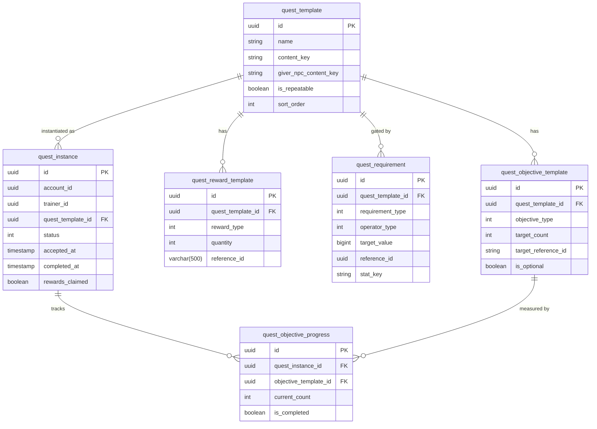

# Quest System

Quests are the primary structured progression mechanism in Crystalline Rift. The system separates read-only template data (content) from mutable instance data (player state), evaluates gating requirements, tracks per-objective progress, and writes lifetime stats as a side-effect of every progress event.

## Why This Design?

### Why Separate Templates from Instances?

A quest template is content — defined once by a designer, shared across all trainers. A quest instance is state — one trainer's active or completed run of that template. Keeping them in separate tables means the template table is essentially read-only after shipping content, and all write pressure goes to the instance and progress tables where it belongs.

This mirrors the Class/Object relationship: `quest_template` is the class, `quest_instance` is the object. The same template can produce many instances (for repeatable quests, one per repeat), each with its own accept time, progress counters, and reward state.

### Why `content_key` on Templates?

Quest templates carry a `content_key` (e.g. `"quest_talk_to_elder"`) for the same reason NPCs and spawners do — it bridges the backend database to Unity's `QuestDefinition` ScriptableObjects. The Unity client references quests by `content_key` to resolve display names, descriptions, and objective data from SOs without a live database read. `content_key` is globally unique across all quest templates.

The `giver_npc_content_key` column links a template to the NPC that offers it, using the same string key that appears on the NPC's `content_key` column. When a player opens an NPC's quest list, the client calls `GetAvailableQuestsForTrainerAsync(accountId, trainerId, npcContentKey, ct)` — the backend filters `quest_template.giver_npc_content_key = npcContentKey` to return only that NPC's quests.

### Why AND Logic for Requirements (No OR)?

Requirement evaluation uses strict AND semantics — all rows in `quest_requirement` for a given template must pass for the quest to become available. This covers the vast majority of gating scenarios (reach level X, complete quest Y, have item Z) while keeping `IConditionEvaluator` simple and deterministic. OR logic creates combinatorial evaluation paths that are harder to debug and harder for designers to reason about. If OR-style gating is needed, express it as separate quest templates gating a third template rather than OR rows in the same requirement list.

### Why Do Stat Writes Happen in the Quest Domain?

The Stats domain tracks lifetime career totals. The Quest domain is the subsystem that knows a meaningful player action occurred (a battle was won, a creature was captured). Rather than requiring the battle system or capture system to know about the Stats domain directly, `RecordProgressEventAsync` is the chokepoint — every action that advances a quest objective also represents a trackable career event. This avoids a dependency on Stats from every other domain and gives quest progress and stat writes the same transactional scope.

## Data Model


```mermaid
erDiagram
    quest_template {
        uuid id PK
        string name
        string content_key
        string giver_npc_content_key
        boolean is_repeatable
        int sort_order
    }
    quest_objective_template {
        uuid id PK
        uuid quest_template_id FK
        int objective_type
        int target_count
        string target_reference_id
        boolean is_optional
    }
    quest_reward_template {
        uuid id PK
        uuid quest_template_id FK
        int reward_type
        int quantity
        varchar(500) reference_id
    }
    quest_requirement {
        uuid id PK
        uuid quest_template_id FK
        int requirement_type
        int operator_type
        bigint target_value
        uuid reference_id
        string stat_key
    }
    quest_instance {
        uuid id PK
        uuid account_id
        uuid trainer_id
        uuid quest_template_id FK
        int status
        timestamp accepted_at
        timestamp completed_at
        boolean rewards_claimed
    }
    quest_objective_progress {
        uuid id PK
        uuid quest_instance_id FK
        uuid objective_template_id FK
        int current_count
        boolean is_completed
    }

    quest_template ||--o{ quest_objective_template : "has"
    quest_template ||--o{ quest_reward_template : "has"
    quest_template ||--o{ quest_requirement : "gated by"
    quest_template ||--o{ quest_instance : "instantiated as"
    quest_instance ||--o{ quest_objective_progress : "tracks"
    quest_objective_template ||--o{ quest_objective_progress : "measured by"
```

For full column descriptions see the table breakdowns in the sections below.

## The shipped quest chain

Eight quests (M7014) follow the habitat level ladder, so "where do I go next" is answered by a quest
rather than by walking into a habitat twenty levels above you. Each gates on the one before it; the
middle rungs also gate on creature level.

M7014 also seeds **First Battle** (`quest-first-battle`), the quest the first three rungs require.
It is authored as a QuestDefinition and synced into the client's SQLite at world init, but nothing
seeded it into Postgres — so on a fresh deployment the prerequisite did not exist, could never be
completed, and the three meadow quests were filtered out of the available list forever.

| Quest | Area | Objectives | Requires | XP / gold |
|---|---|---|---|---|
| Thin the Meadow | Meadow | defeat 5 creatures | First Battle | 150 / 60 |
| A Second Companion | Meadow | capture any creature | First Battle | 150 / 60 |
| Supplies for Hearthmere | Village | visit Hearthmere, talk to the trader | First Battle | 120 / 100 |
| The Road to the Shore | → Shore | reach the Shore | Thin the Meadow | 250 / 100 |
| Tidewrack Trials | Shore | win 8 battles | Road to the Shore, creature ≥ 6 | 600 / 220 |
| Into the Dark | Cave | enter the Cave, defeat 10 | Tidewrack Trials, creature ≥ 10 | 1,200 / 400 |
| The Windbitten Climb | Crags | reach the Crags, raise a creature to 18 | Into the Dark | 2,200 / 700 |
| Sunbleached | Dunes | reach the Dunes, raise a creature to 25 | Windbitten Climb | 4,500 / 1,500 |

Rewards are sized against the re-curved experience table at roughly one to two levels' worth *at the
level the quest is meant for* — 150 in the meadow where a level costs about 90, 4,500 in the dunes.

Three things this chain depends on, each of which was a trap:

- **`VisitLocation` needs a trigger in the scene.** `LocationTriggerBehaviour` existed, complete and
  injected, and was placed in exactly zero scenes — so every VisitLocation objective was unreachable
  and every location achievement unwinnable. `cr_polish_areas` now puts one in each area, sized to
  the whole playable space and keyed to the area key.
- **Prerequisites must sync before their dependants.** `LocalQuestTemplateSyncClient` resolves a
  requirement's `referenceId` from a content key to the template's database id by looking it up — and
  if it is not there yet it warns and stores **null**, which reads as "no prerequisite". The order of
  `ContentDefinitionProvider.quests` is therefore load-bearing; the chain is registered in dependency
  order.
- **The seed ids are UUIDv5 of the content key**, matching what the authored assets carry. A seed
  with an id of its own is discarded the moment Content Studio pushes the asset — the unique index is
  on `content_key`, so the row already exists and every objective and reward hangs off a template
  nothing points at.

:::caution
The quest seed is **Postgres only**. M7012 deleted the earlier M7006/M7008 seeds out of SQLite
because migration rows there go stale against the designer-authored assets, and the client syncs
every SO in `ContentDefinitionProvider.quests` into local SQLite at world init. Seeding SQLite from a
migration rebuilds exactly the divergence M7012 exists to remove.
:::

### The onboarding quest has two ids in history — only one is live

`M7008_SeedWelcomeToCRQuest` seeded an onboarding quest under `content_key = "quest_welcome_to_cr"`
(underscore), id `F0E1D2C3-…`. That quest is **not** the one anything in Unity grants — it predates
the `QuestDefinition` ScriptableObject rewrite of onboarding and was superseded by a hand-authored SO
(`Assets/CR/Content/Defs/Quests/Starter Quest.asset`, `content_key = "quest-welcome-to-cr"`, hyphen,
id `f1921cfd-26a0-4b70-b45f-0e28a58fb7e1`) that Content Studio pushed to Postgres directly — never
through a migration. `M7008`'s row has since been manually removed from dev/prod Postgres (Studio
deletes aren't migration-tracked, so `VersionInfo` still shows `M7008` as applied even though its row
is gone).

Because nothing ever baked the **live** quest, a fresh Postgres deployment (new environment, CI, a
teammate's first `docker compose up`) had no server-side row for `quest-welcome-to-cr` at all — the
identical id/content_key existed only in every player's local SQLite (synced from the SO at every
world init), so `AcceptQuestAsync` online would 404/fail on the FK the moment anyone actually tried it
there. `M7015_SeedLiveWelcomeToCRQuest` fixes this: it seeds the SAME id/content_key/objective/reward
the SO carries, Postgres only (SQLite already gets this from the SO sync — seeding it there too would
recreate the exact divergence M7012 removed), guarded so a Content Studio push that already fully
authored the template (parent row **and** its own objective/reward children) is left completely
alone — the guard checks "does this template have any children yet", not just "does a child with my
own hardcoded id exist", so it never bolts a duplicate objective/reward onto an already-authored
template. Covered by `WelcomeQuestSeedPostgresTests` / `WelcomeQuestSeedGuardPostgresTests` in
`Convenience/CR.Data.Migrations.Test`.

:::note
Investigating this also surfaced that `quest_objective_template` / `quest_reward_template` carry
**eight duplicate rows** each for the live `quest-welcome-to-cr` template in dev Postgres — repeated
Content Studio pushes insert new child rows instead of upserting against existing ones (unlike the
parent `quest_template` row, which IS matched by `content_key`). This is a separate, still-open bug in
the Content Studio push path (`PUT /api/v1/quests/templates/bulk` → `UpsertTemplateWithChildrenAsync`,
step 4/6 in the walkthrough above soft-deletes *all* existing children before re-inserting, which
should be idempotent — the duplicates predate that soft-delete-then-insert design and were never
cleaned up). Not fixed here: live `quest_objective_progress`/`quest_instance` rows for existing
trainers may reference specific one of the eight objective/reward ids, so cleanup needs its own
FK-safe migration. Flagging for a follow-up rather than touching production data as a side effect of
this fix.
:::

## How to Define a New Quest (Step-by-Step)

### Step 1: Create the migration

Name the migration file with the next migration number and a descriptive suffix:

```csharp
[Migration(7010)]
public class M7010_AddBattleTrialQuest : FluentMigrator.Migration
{
    private const string TemplateId    = "11111111-0000-0000-0000-000000000001";
    private const string Objective1Id  = "22222222-0000-0000-0000-000000000001";
    private const string RewardId      = "33333333-0000-0000-0000-000000000001";

    public override void Up()
    {
        var isSqlite = ConnectionString.ToLower().Contains("data source") ||
                       ConnectionString.ToLower().Contains("sqlite");

        if (isSqlite)
        {
            Execute.Sql($@"
                INSERT OR IGNORE INTO quest_template
                  (id, name, description, content_id, content_key, giver_npc_content_key,
                   is_repeatable, max_repeat_count, sort_order, deleted, created_at, updated_at)
                VALUES
                  ('{TemplateId}', 'Battle Trial', 'Win 3 battles to prove your worth.',
                   '{TemplateId}', 'quest_battle_trial', 'kael_trainer_npc',
                   0, 0, 10, 0, datetime('now'), datetime('now'))
            ");
            Execute.Sql($@"
                INSERT OR IGNORE INTO quest_objective_template
                  (id, quest_template_id, objective_type, description,
                   target_count, target_reference_id, target_metadata,
                   is_optional, sort_order, deleted, created_at, updated_at)
                VALUES
                  ('{Objective1Id}', '{TemplateId}', 3, 'Win 3 battles',
                   3, NULL, NULL,
                   0, 1, 0, datetime('now'), datetime('now'))
            ");
        }
        else
        {
            Execute.Sql($@"
                INSERT INTO quest_template
                  (id, name, description, content_id, content_key, giver_npc_content_key,
                   is_repeatable, max_repeat_count, sort_order, deleted, created_at, updated_at)
                VALUES
                  ('{TemplateId}', 'Battle Trial', 'Win 3 battles to prove your worth.',
                   '{TemplateId}', 'quest_battle_trial', 'kael_trainer_npc',
                   false, 0, 10, false, now(), now())
                ON CONFLICT (id) DO NOTHING
            ");
            Execute.Sql($@"
                INSERT INTO quest_objective_template
                  (id, quest_template_id, objective_type, description,
                   target_count, target_reference_id, target_metadata,
                   is_optional, sort_order, deleted, created_at, updated_at)
                VALUES
                  ('{Objective1Id}', '{TemplateId}', 3, 'Win 3 battles',
                   3, NULL, NULL,
                   false, 1, false, now(), now())
                ON CONFLICT (id) DO NOTHING
            ");
        }
    }

    public override void Down()
    {
        Execute.Sql($"DELETE FROM quest_objective_template WHERE quest_template_id = '{TemplateId}'");
        Execute.Sql($"DELETE FROM quest_template WHERE id = '{TemplateId}'");
    }
}
```

Key points:
- `objective_type` = 3 is `WinBattles` (see enum table below)
- `target_count` = 3 means the player must win 3 battles
- `giver_npc_content_key` must match the `content_key` of an existing NPC or be `NULL` for world quests
- Use `0`/`false` for booleans (engine-aware as shown)
- Always provide a `Down()` that cleans up seed data

### Step 2: Create a `QuestDefinition` ScriptableObject in Unity

In the Unity editor, right-click in the Project window and select **Create → CR → Quest Definition**. Fill in the inspector fields:

| Field | Value |
|-------|-------|
| `contentKey` | `"quest_battle_trial"` — must match the migration exactly |
| `questName` | `"Battle Trial"` |
| `description` | `"Win 3 battles to prove your worth."` |
| `giverNpcContentKey` | `"kael_trainer_npc"` |
| `isRepeatable` | false |
| `objectives[0].objectiveType` | `WinBattles` |
| `objectives[0].description` | `"Win 3 battles"` |
| `objectives[0].targetCount` | 3 |

The SO is the Unity-side source of truth for display data. The `content_key` must match the database row exactly. Push the template to the server with **Content Studio → Quests → ⬆ Push All** (`PUT /api/v1/quests/templates/bulk`) rather than writing a separate migration for the template row — the migration is only needed for seed data in environments without the editor.

### Step 3: Add a requirement (optional)

To gate the quest behind another quest being completed:

```sql
-- Postgres
INSERT INTO quest_requirement
  (id, quest_template_id, requirement_type, operator_type,
   target_value, reference_id, stat_key, deleted, created_at, updated_at)
VALUES
  (gen_random_uuid(), '<TemplateId>', 0, 0,
   1, '<PrecedingQuestTemplateId>', NULL, false, now(), now());
-- requirement_type 0 = QuestCompleted, operator_type 0 = GreaterThanOrEqual, target_value 1 = at least 1 completion
```

## How to Advance a Quest Objective from Unity

The Unity client calls `POST /api/v1/quests/progress` after any game event that might satisfy an objective. The call should be fire-and-forget from the game logic perspective — it records the event and the backend handles matching it against active quests.

```csharp
// In the battle system, after a win
await _questClient.RecordProgressAsync(new QuestProgressRequest
{
    AccountId    = _session.AccountId,
    TrainerId    = _session.TrainerId,
    ObjectiveType = QuestObjectiveType.WinBattles,   // int value 3
    Amount        = 1,
    ReferenceId   = null,   // not needed for WinBattles
});
```

The HTTP call:

```bash
curl -s -X POST http://localhost:5000/api/v1/quests/progress \
  -H "Authorization: Bearer $TOKEN" \
  -H "Content-Type: application/json" \
  -d '{
    "accountId":     "aaaaaaaa-...",
    "trainerId":     "bbbbbbbb-...",
    "objectiveType": 3,
    "amount":        1,
    "referenceId":   null
  }'
```

Response:
```json
{
  "updatedInstances": [
    {
      "instanceId": "cccccccc-...",
      "newStatus":  "InProgress",
      "objectives": [
        {
          "objectiveTemplateId": "22222222-...",
          "currentCount": 1,
          "targetCount":  3,
          "isCompleted":  false
        }
      ]
    }
  ]
}
```

If the third win occurs, `newStatus` becomes `"Completed"` and `isCompleted` becomes `true`. The Unity client inspects `newStatus` to trigger the quest-complete celebration animation and enable the reward claim button.

The same `RecordProgressEventAsync` call also writes the `battles_won` lifetime stat regardless of whether any quest matched.

## Reading Quests from Unity (the quest journal)

Game code never touches `IQuestClient` or `IQuestDomainService` directly. Everything goes through
`QuestManager`, which holds the session (`SetSession(accountId, trainerId)`) and delegates to
`IQuestRepository` — the online/offline router (`QuestOnlineOfflineRepository`).

Read surface used by the player menu's **Quests** tab (`Assets/CR/UI/Quests/QuestJournalView.cs`):

| `QuestManager` method | Routes to | Notes |
|---|---|---|
| `RefreshActiveQuestsAsync(ct)` | `IQuestRepository.GetActiveQuestsAsync` | Re-reads InProgress instances and replaces the in-memory list seeded by `QuestWorldBehaviour`. |
| `GetCompletedQuestsAsync(ct)` | `IQuestRepository.GetCompletedQuestsAsync` | Completed instances. |
| `GetTemplateAsync(templateId, ct)` | `IQuestRepository.GetQuestTemplateAsync` | Name, description, objective texts, rewards. |
| `AbandonQuestAsync` / `ClaimRewardsAsync` | as before | Unchanged lifecycle calls. |

`QuestManager` also exposes `AccountId`, `TrainerId`, and `HasSession` so a UI can decline to load
before world init has run rather than throwing out of `AssertSession`.

For code driven by gameplay events that can fire *before* world init finishes, `QuestManager.WhenReady`
is a `Task` that completes when `LoadActiveQuests` seeds the manager at the end of
`QuestWorldBehaviour.InitializeAsync`. `QuestGranterBehaviour` awaits it (120 s timeout) before
resolving a quest's template: its `OnTrainerSelected` trigger fires at character select, but the local
`quest_template` tables are only synced during the world bootstrap that follows — an ungated grant
looked up the template too early, found nothing, and the quest (and its rewards, e.g. the welcome
quest's starter creature) was silently never accepted.

**`WhenReady` is per-session, not a one-shot flag.** It used to be a bare `TaskCompletionSource` that
was only ever completed once — which protected exactly the *first* trainer selected in a process, and
nothing after it. Every trainer selected later in the same run saw `WhenReady` already `IsCompleted`
(stale, left over from the previous trainer's session) and skipped the wait entirely, racing
`QuestWorldBehaviour.InitializeAsync` for its own session. Symptom: switching from offline play to a
second/subsequent online trainer silently dropped the auto-granted "Welcome To CR" quest (and its
creature reward) — no error, no server request, just `[QuestGranterBehaviour] No template found for
contentKey='quest-welcome-to-cr'` in the log, timestamped well before that trainer's own
`QuestWorldBehaviour.InitializeAsync` had even started. Fixed by extracting the gate into
`QuestSessionReadyGate` (`Assets/CR/Quests/Manager/Logic/QuestSessionReadyGate.cs`, engine-free,
unit tested) and adding `QuestManager.BeginSession()`, which resets the gate to a fresh, incomplete
state whenever it's already signalled ready. `CharacterSelectController.SelectAsync` calls
`BeginSession()` as the very first statement — before `SetTrainerAsync`, before `EnterOverworld`,
before the `OnTrainerSelected` event that `QuestGranterBehaviour` reacts to — so no later trainer
selection can observe a stale gate.

### "New quest" toast and dedup

`QuestManager.OnQuestGranted` fires the first time this session becomes aware of a quest instance
that was not already active for the trainer when the session started — regardless of how it became
active:

- auto-granted on trainer select (`QuestGranterBehaviour` → `AcceptQuestAsync`)
- accepted from a dialogue node (`QuestDialogueBridge.HandleQuestAccepted` → `AcceptQuestAsync`)
- discovered purely server-side on a later sync (`RefreshActiveQuestsAsync`, e.g. opening the
  Quests tab after the server granted something the client never requested)

Dedup is `QuestToastPolicy` (`Assets/CR/Quests/Manager/Logic/QuestToastPolicy.cs`, engine-free, unit
tested): `LoadActiveQuests` establishes a baseline of the trainer's already-active instance ids
*before* completing the ready gate, so a quest re-observed on every subsequent
`RefreshActiveQuestsAsync` call (the Quests tab reloads every time it's opened — see
`PlayerMenuWindow.LoadTab`) toasts at most once per instance id, ever, for the life of the process.
`AchievementToastPresenter` (despite the name — see `docs/backend/15-achievements.md`) subscribes to
`OnQuestGranted` and shows `"New quest: {name}"` through the same toast queue as achievement unlocks
and `WorldToast`. The quest journal (`QuestJournalView`) needs no separate live-update wiring for
this — `PlayerMenuWindow` already reloads every tab's data on every open/tab-switch, so a newly
granted quest is picked up the next time the Quests tab renders.

### Authored template ids are authoritative

A `QuestDefinition` SO's `id` is the content GUID mirrored by the server's `quest_template` row.
`LocalQuestTemplateSyncClient` passes it through, and `UpsertTemplateWithChildrenAsync` honors it:
a fresh insert uses the authored id, and an existing row born under a minted id is **re-keyed** to
the authored id (children, cross-quest `quest_requirement.reference_id` references, and — where the
table exists in the same database — `quest_instance` rows all follow; no FK constraints reference
`quest_template`, so ordering is free and the operation is idempotent). Without this, online accept
resolved the template from the local DB and sent the server a minted id it had never seen — a
400 Bad Request and a quest that never started. An empty caller id keeps the old
keep-existing/mint-new behavior.

### Quest endpoints are token-authoritative for the account

Every trainer-facing quest handler derives the account from the Bearer token
(`HttpContext.GetAccountId()`), never from the client-supplied accountId (the body/query fields
remain for wire compatibility but are ignored). A client carrying a stale stored account id —
seen live after a server reset — used to write quest instances under an account that no longer
existed, splitting quest state from the trainer ("no quests, no creatures"). The auth responses
(`/auth/game`, `/auth/basic`, `/auth/oauth`) now return `accountId`, and the Unity client
overwrites its stored account id from that value on every successful authentication
(`GameAuthRepository.PersistAccountTokenLocally`). Pinned by
`CR.Api.IntegrationTests.QuestIdentityHttpTests` (bogus body accountId must not be persisted;
auth must echo the account id).

A token that passes the fallback authentication policy but carries no account claim is an
authorization problem, not a server fault: every quest handler now catches
`UnauthorizedAccessException` from `GetAccountId()` and returns `401 Unauthorized`, where it
previously fell through to the generic `catch (Exception)` and answered `500`.

### Why those two reads do not branch on connectivity

`GetActiveQuestsAsync` is the only read that has a server endpoint; the two added reads are answered
locally in **both** modes, deliberately:

- **Completed instances** — there is no `/completed` REST endpoint. The router already mirrors every
  server-returned instance into the local `quest_instance` table (active fetch, `/progress` results,
  claim results), so online play reads its own mirror instead of inventing a round-trip with nothing
  to call.
- **Templates** — templates are *content*, not player state. `QuestWorldBehaviour` syncs every
  `QuestDefinition` SO into the local `quest_template` tables at world init regardless of
  connectivity, so the local domain service is the correct source in either mode and costs no
  network hop.

### Instance vs template in the UI

A `QuestInstance` carries only IDs, status and counts. Objective *text* lives on
`QuestObjectiveTemplate`, so the journal pairs each `QuestObjectiveProgress` row to its template by
`ObjectiveTemplateId`. An objective with no progress row yet (progress never recorded) still renders,
at zero — so the player sees the full task list the moment they accept.

Roll-up maths and the "may this quest be claimed" rule are **not** in the view: they live in the
engine-free `CR.UI.Logic` assembly (`QuestProgressCalculator`, `QuestActionPolicy`) and are unit
tested. Optional objectives never hold the headline progress bar back, and `CanClaim` requires
`Completed && !RewardsClaimed` — claiming grants rewards, so a double claim is the failure that
matters.

> Note: `QuestRewardDispatcher` auto-claims on `OnQuestCompleted`, so most completed quests already
> have `RewardsClaimed = true` by the time the journal opens and correctly show no Claim button. The
> button exists for instances whose auto-claim did not land.

## Quest Lifecycle

```
Available
  │  AcceptQuestAsync
  ▼
InProgress
  │  RecordProgressEventAsync (auto-transitions when all required objectives complete)
  ▼
Completed ─── ClaimRewardsAsync ──► rewards_claimed = true
  │
  │  (also valid from InProgress)
  ▼
Abandoned  (AbandonQuestAsync)
```

**Available** — a quest is available when:
- The trainer has no active (InProgress) instance of this template
- The template is not already completed, OR `is_repeatable = true` and `repeat_number < max_repeat_count` (or `max_repeat_count = 0`)
- All `quest_requirement` rows evaluate to true (AND logic); if there are no requirement rows the quest is ungated

**InProgress** — created by `AcceptQuestAsync`. A matching `quest_objective_progress` row is created for every non-deleted objective template at accept time.

`AcceptQuestAsync` is **idempotent**: a non-repeatable template with any existing instance (any
status) returns that instance instead of creating another, and a repeatable template only
re-accepts when no instance is currently in progress. This matters because scene auto-granters
(`QuestGranterBehaviour`) re-fire every session — before the guard, a non-repeatable quest
stacked one instance per boot, and a single progress event then completed every copy in one
serial claim burst (seen live: 38 stacked "Welcome To CR" instances ≈ a 10-second freeze).

**Completed** — `RecordProgressEventAsync` increments matching progress rows, then checks whether every non-optional objective has `is_completed = true`. If so, the instance status transitions to `Completed` automatically.

**Claimed** — `ClaimRewardsAsync` sets `rewards_claimed = true` and increments the `quests_completed` lifetime stat. Double-claim throws.

**Abandoned** — `AbandonQuestAsync` sets status to `Abandoned`. Instance is retained for audit.

### Repeatable Quest Reset

When `is_repeatable = true`, a trainer can accept the same template again after completing it:

1. Trainer completes run 1 → instance `repeat_number = 1`, status = Completed
2. `ClaimRewardsAsync` sets `rewards_claimed = true`
3. The template reappears in `GetAvailableQuestsForTrainerAsync` because no active instance exists and the template is repeatable
4. Trainer accepts again → new instance created with `repeat_number = 2`
5. **Progress rows start at 0 for the new instance** — the previous instance's progress is not carried over

**What fields are cleared:** The old `quest_instance` is not modified — it is left as Completed/claimed as an audit record. A new `quest_instance` row is created with `repeat_number` incremented. The old `quest_objective_progress` rows belong to the old instance and are left untouched. New progress rows start at `current_count = 0`.

`max_repeat_count = 0` means unlimited repeats. Once the cap is reached, the template is excluded from available quests.

## Enums

### `QuestObjectiveType`

| Value | Int | Description |
|-------|-----|-------------|
| `DefeatCreature` | 0 | Defeat a specific creature (matched by `target_reference_id`) |
| `DefeatAnyCreature` | 1 | Defeat any creature; `target_reference_id` is ignored |
| `DealDamageOfType` | 2 | Deal damage using a specific type; `target_reference_id` = damage type |
| `WinBattles` | 3 | Win any battle encounters |
| `CaptureCreature` | 4 | Capture a specific creature (matched by `target_reference_id`) |
| `CaptureAnyCreature` | 5 | Capture any creature; `target_reference_id` is ignored |
| `DealDamage` | 6 | Deal any amount of damage |
| `HealAmount` | 7 | Heal any amount |
| `ReachCreatureLevel` | 8 | Raise a creature to a specific level |
| `VisitLocation` | 10 | Travel to a named location |
| `TalkToNpc` | 11 | Interact with a specific NPC |
| `CollectItem` | 20 | Collect a specific item |
| `CompleteQuest` | 30 | Complete another quest (used for chain objectives) |

### `QuestRequirementType`

| Value | Int | Evaluated by |
|-------|-----|--------------|
| `QuestCompleted` | 0 | Checks `quest_instance` for a completed run of `reference_id` |
| `StatThreshold` | 1 | Reads `stat_key` from `IStatService`, applies `operator_type` vs `target_value` |
| `HasItem` | 2 | Sums item quantities across all trainer inventories where `BaseItemId == reference_id` |
| `CreatureLevel` | 3 | If `reference_id` set: stat `creature_level_{id}`; else `highest_creature_level` |
| `TrainerLevel` | 4 | Reads stat `trainer_level`, applies `operator_type` vs `target_value` |

### `RequirementOperator`

| Value | Int |
|-------|-----|
| `GreaterThanOrEqual` | 0 |
| `LessThanOrEqual` | 1 |
| `Equal` | 2 |

## Domain Service Interface

Source: `Quests/CR.Quests.Domain.Services/Interface/IQuestDomainService.cs`

```csharp
Task<QuestTemplate?> GetQuestTemplateAsync(Guid templateId, CancellationToken ct);

Task<IReadOnlyList<QuestTemplate>> GetAvailableQuestsForTrainerAsync(
    Guid accountId, Guid trainerId, string? giverNpcContentKey, CancellationToken ct);

Task<IReadOnlyList<QuestInstance>> GetActiveQuestsAsync(
    Guid accountId, Guid trainerId, CancellationToken ct);

Task<QuestInstance?> GetQuestInstanceAsync(
    Guid accountId, Guid trainerId, Guid instanceId, CancellationToken ct);

Task<QuestInstance> AcceptQuestAsync(
    Guid accountId, Guid trainerId, Guid templateId, CancellationToken ct);

Task AbandonQuestAsync(
    Guid accountId, Guid trainerId, Guid instanceId, CancellationToken ct);

Task<QuestProgressResult> RecordProgressEventAsync(
    Guid accountId, Guid trainerId, QuestProgressEvent evt, CancellationToken ct);

Task<QuestInstance> ClaimRewardsAsync(
    Guid accountId, Guid trainerId, Guid instanceId, CancellationToken ct);
```

### `QuestProgressEvent`

```csharp
public class QuestProgressEvent
{
    public QuestObjectiveType ObjectiveType { get; set; }
    public int Amount { get; set; }
    public string? ReferenceId { get; set; }  // content key: creature, item, location, etc.
}
```

### Stat Side-Effects of `RecordProgressEventAsync`

Every progress event also increments a lifetime stat regardless of whether any quest objective matched:

| ObjectiveType | Stat written | Operator |
|---------------|-------------|---------|
| `WinBattles` | `battles_won` | Increment |
| `DefeatCreature`, `DefeatAnyCreature` | `creatures_defeated_total` | Increment |
| `CaptureCreature`, `CaptureAnyCreature` | `creatures_captured_total` | Increment |
| `DealDamage`, `DealDamageOfType` | `damage_dealt_total` | Increment |
| `HealAmount` | `damage_healed_total` | Increment |
| `CollectItem` | `items_collected_total` | Increment |
| `ReachCreatureLevel` | `creature_level_{referenceId}` (content key) AND `highest_creature_level` | Max |

Quest-scoped progress resets with each instance. Lifetime stats never reset.

## Condition Evaluator

`IConditionEvaluator` is used internally by `GetAvailableQuestsForTrainerAsync` to gate quest availability:

```csharp
// Short-circuits on first failure. Used as the accept gate — cheap and authoritative.
Task<bool> EvaluateAllAsync(
    IReadOnlyList<QuestRequirement> requirements,
    Guid accountId, Guid trainerId, CancellationToken ct);

// Evaluates every requirement individually. Never short-circuits.
// Returns a RequirementCheckResult per row — use for locked-quest preview UI.
Task<IReadOnlyList<RequirementCheckResult>> EvaluateEachAsync(
    IReadOnlyList<QuestRequirement> requirements,
    Guid accountId, Guid trainerId, CancellationToken ct);
```

`EvaluateEachAsync` is for client-side "locked quest" previews — the trainer sees a quest they cannot yet accept, with each unmet requirement highlighted (e.g. "Complete quest X", "Reach trainer level 5"). Do **not** use it as the accept gate; use `EvaluateAllAsync` there.

`RequirementCheckResult` pairs the original `QuestRequirement` with a `bool Met` flag, giving the caller full context to render requirement state without a second lookup.

## REST Endpoints

All quest endpoints are prefixed `/api/v1/quests`.

| Method | Path | Description |
|--------|------|-------------|
| `GET` | `/api/v1/quests/available` | List available quest templates for a trainer |
| `GET` | `/api/v1/quests/active` | List InProgress quest instances for a trainer |
| `GET` | `/api/v1/quests/{instanceId}` | Get a specific quest instance by ID |
| `POST` | `/api/v1/quests/accept` | Accept a quest and create an instance |
| `POST` | `/api/v1/quests/abandon` | Abandon an active quest instance |
| `POST` | `/api/v1/quests/progress` | Record a progress event against active quests |
| `POST` | `/api/v1/quests/claim` | Claim rewards for a completed quest |
| `PUT` | `/api/v1/quests/templates/bulk` | Bulk create-or-update quest templates by `content_key` (Content Studio sync) |
| `GET` | `/api/v1/quests/templates/by-content-key/{contentKey}` | One template with objectives, rewards and requirements; 404 on unknown key. The Unity `QuestTemplateOnlineOfflineRepository` calls this only when a `content_key` misses the local `quest_template` cache, then upserts the result locally |

### Query parameters (GET endpoints)

`GET /api/v1/quests/available?accountId=&trainerId=&npcContentKey=`

`npcContentKey` is optional. When supplied, only quests with a matching `giver_npc_content_key` are returned. When omitted, all available quests for the trainer are returned.

### Request/response examples

```json
POST /api/v1/quests/accept
{
  "accountId":  "00000000-...",
  "trainerId":  "00000000-...",
  "templateId": "11111111-0000-0000-0000-000000000001"
}

→ 200 OK  (QuestInstance)
{
  "instanceId":    "cccccccc-...",
  "templateId":    "11111111-...",
  "status":        "InProgress",
  "acceptedAt":    "2026-03-13T10:00:00Z",
  "objectives": [
    { "objectiveTemplateId": "22222222-...", "currentCount": 0, "targetCount": 3, "isCompleted": false }
  ]
}
```

```json
POST /api/v1/quests/progress
{
  "accountId":     "00000000-...",
  "trainerId":     "00000000-...",
  "objectiveType": 3,
  "amount":        1,
  "referenceId":   null
}

→ 200 OK  (QuestProgressResult)
{
  "updatedInstances": [
    {
      "instanceId": "cccccccc-...",
      "newStatus":  "InProgress",
      "objectives": [
        { "objectiveTemplateId": "22222222-...", "currentCount": 1, "targetCount": 3, "isCompleted": false }
      ]
    }
  ]
}
```

```json
POST /api/v1/quests/claim
{ "accountId": "...", "trainerId": "...", "instanceId": "cccccccc-..." }

→ 200 OK
{
  "instance": { /* QuestInstance with rewards_claimed: true */ },
  "spawnedCreatureIds": ["<guid>", "..."]
}
```

`ClaimRewardsAsync` returns a typed `QuestClaimResult`:

| Field | Type | Purpose |
|-------|------|---------|
| `Instance` | `QuestInstance` | Updated instance row with `rewards_claimed = true` |
| `SpawnedCreatureIds` | `Guid[]` | Creature IDs spawned by `RewardType.Creature` rewards — consumers must place these into the trainer's team or storage |

On the Unity client, `QuestManager.ClaimRewardsAsync` deserializes this result and forwards it to `QuestRewardDispatcher`, which places spawned creatures, fires `OnRewardsDispatched`, and routes through the event-wiring system (see `docs/unity/15-event-wiring.md`). Stat writes (`TrainerExperiencePoints`, `QuestsCompleted`) are performed by the backend during `ClaimRewardsAsync` — the Unity side must not double-write them.

### Content Studio sync: `PUT /api/v1/quests/templates/bulk`

Used by the Unity editor Content Studio to push `QuestDefinition` ScriptableObjects to the server. Each entry is matched by `content_key` and the template row plus all its objectives, rewards, and requirements are replaced atomically.

```json
PUT /api/v1/quests/templates/bulk
[
  {
    "contentKey": "quest_battle_trial",
    "name": "Battle Trial",
    "description": "Win 3 battles to prove your worth.",
    "giverNpcContentKey": "kael_trainer_npc",
    "isRepeatable": false,
    "maxRepeatCount": 0,
    "sortOrder": 10,
    "objectives": [
      {
        "objectiveType": 3,
        "description": "Win 3 battles",
        "targetCount": 3,
        "targetReferenceId": null,
        "targetMetadata": null,
        "isOptional": false,
        "sortOrder": 0
      }
    ],
    "rewards": [
      {
        "rewardType": 1,
        "quantity": 500,
        "referenceId": null,
        "metadata": null
      }
    ],
    "requirements": [
      {
        "requirementType": 0,
        "operatorType": 0,
        "targetValue": 1,
        "referenceId": "quest_intro_talk_to_oak",
        "statKey": null
      }
    ]
  }
]

→ 200 OK
{
  "count": 1,
  "templates": [
    { "id": "11111111-...", "contentKey": "quest_battle_trial", "name": "Battle Trial", ... }
  ]
}
```

`requirements` is optional. Omitting it (or passing `null`) leaves existing `quest_requirement` rows untouched. Passing an empty array clears all requirements. Passing entries replaces them.

The handler uses `IQuestTemplateRepository.UpsertTemplateWithChildrenAsync`, which:
1. Looks up the existing template by `content_key`.
2. If found: UPDATEs the template row and preserves its original `id` and `created_at`.
3. If not found: INSERTs a new template row with a generated `id`.
4. Soft-deletes all existing objective rows for this template (`deleted = 1`).
5. INSERTs fresh objective rows (new `id` per row).
6. Soft-deletes all existing reward rows for this template.
7. INSERTs fresh reward rows.
8. If `requirements` was supplied: soft-deletes existing requirement rows, then INSERTs fresh ones.

A `400 Bad Request` is returned if the request body is empty or any entry has a blank `contentKey`.

## Reward Claiming

`ClaimRewardsAsync` distributes all rewards defined in `quest_reward_template` for the completed quest instance before marking it claimed. Each reward row is processed by `GrantRewardAsync`, which dispatches on `RewardType`.

### M7011 Migration

`M7011_QuestRewardRefToText` changes `quest_reward_template.reference_id` from `UUID` to `VARCHAR(500)` on Postgres. SQLite stores all values as TEXT so no DDL change is needed there. The column now holds designer content keys (e.g. `"item_potion"`, `"spawner_starter_cindris"`) rather than opaque UUIDs.

### Implemented reward types

| `RewardType` | `referenceId` semantics | Behaviour |
|---|---|---|
| `Experience` (0) | Not used | Increments the `trainer_xp` stat by `quantity` via `IStatService.IncrementAsync` |
| `Currency` (1) | `content_key` of the currency item in the `item` table | Looks up the item by `IItemDomainService.GetItemByContentKeyAsync`, then calls `ITrainerInventoryDomainService.AddItemAsync(trainerId, item.Id, quantity)` |
| `Item` (2) | `content_key` of the item in the `item` table | Same as Currency — both reward types resolve to inventory items |
| `Creature` (3) | `content_key` of a global spawner template | Looks up the spawner via `ISpawnerRepository.GetSpawnerTemplateByContentKeyAsync`, then calls `ICreatureSpawnDomainService.SpawnCreaturesAsync(spawner.Id, new SpawnRequest { TrainerId = trainerId, RequestedQuantity = quantity })` |
| `Ability` (4) | `content_key` of a single ability, or `null` for every ability this quest gates | Unlocks quest-gated ability progression entries on the trainer's creatures — see below |

### Ability rewards (quest-gated ability unlocks)

An `Ability` reward does not hand a specific move to a specific creature. It opens the gate on
`ability_progression_set_entry` rows whose `unlock_quest_content_key` names the quest being claimed,
then teaches every ability the trainer's creatures have already become eligible for. See
[Creature Generation → Quest-gated abilities](04-creature-generation.md#quest-gated-abilities) for
the schema and the learning rules.

The trigger chain at claim time:

1. `ClaimRewardsAsync` reads the quest template once (before the reward loop) to get its `content_key`.
2. `GrantRewardAsync` builds `new RewardGrant(RewardType.Ability, quantity, reward.ReferenceId, questContentKey)`.
   `SourceKey` carries the quest's content key; `ReferenceKey` (from `reward.reference_id`) optionally
   narrows the grant to a single ability's content key.
3. `RewardGrantService` dispatches to
   `ICreatureProgressionService.ApplyQuestUnlocksAsync(trainerId, questContentKey, abilityContentKey, ct)`.
4. The returned creature ids are surfaced on `QuestClaimResult.AbilityUnlockedCreatureIds`, separate
   from `SpawnedCreatureIds`. The client should re-read those creatures to show the new move set.

A reward row whose quest template has no `content_key` is skipped with a warning — there would be
nothing to match the progression entries against.

### Deferred reward types

| `RewardType` | Status |
|---|---|
| `Badge` (5) | Logs an informational message; no action taken |
| `Title` (6) | Logs an informational message; no action taken |

### Graceful skip policy

`GrantRewardAsync` never throws. If a required lookup fails (item content key not found, spawner not found, empty `referenceId`), it logs a warning and moves on to the next reward. The `quests_completed` stat and `rewards_claimed = true` are still written — partial reward delivery is preferred over blocking the claim entirely.

### Content Studio usage

When pushing quest templates via `PUT /api/v1/quests/templates/bulk`, set `referenceId` to the content key string directly:

```json
"rewards": [
  { "rewardType": 0, "quantity": 500, "referenceId": null },
  { "rewardType": 2, "quantity": 3,   "referenceId": "item_potion" },
  { "rewardType": 3, "quantity": 1,   "referenceId": "spawner_starter_cindris" }
]
```

The endpoint no longer attempts a GUID parse — any non-blank string is stored as-is.

## DI Registration

`QuestDomainService` must be registered as **Scoped**, not Singleton. It depends on `IConditionEvaluator` (which depends on `IStatService`), `IItemDomainService`, `ITrainerInventoryDomainService`, and `ICreatureSpawnDomainService` — all of which are Scoped:

```csharp
// Program.cs
builder.Services.AddSingleton<IQuestTemplateRepository>(
    new QuestTemplateRepository(questLogger, configuration));
builder.Services.AddSingleton<IQuestInstanceRepository>(
    new QuestInstanceRepository(questLogger, configuration));

if (!isSwaggerGen) new QuestDatabaseMigratorPostgres().Migrate(configuration);

builder.Services.AddScoped<IStatService, StatService>();
builder.Services.AddScoped<IConditionEvaluator, ConditionEvaluator>();
builder.Services.AddScoped<IItemDomainService, ItemDomainService>();
builder.Services.AddScoped<ITrainerInventoryDomainService, TrainerInventoryDomainService>();
// ICreatureSpawnDomainService and ISpawnerRepository already registered above
builder.Services.AddScoped<IQuestDomainService, QuestDomainService>();
```

## Common Mistakes

- **Registering `QuestDomainService` as Singleton.** It must be `AddScoped` because `IConditionEvaluator` depends on `IStatService`, which is Scoped. A Singleton cannot capture a Scoped service.
- **Forgetting both keyed and non-keyed repository registrations in Program.cs.** The domain service resolves non-keyed. REST endpoints that use `[FromKeyedServices]` resolve keyed. Both registrations must exist. Looking at the actual `Program.cs`, quest repositories are registered as non-keyed singletons only — if you add keyed registrations for the quest repositories, also keep the non-keyed ones.
- **Firing `DefeatCreature` instead of `DefeatAnyCreature`.** `DefeatCreature` matches objectives where `target_reference_id` equals the event's `ReferenceId`. `DefeatAnyCreature` matches all defeat-type objectives regardless of `ReferenceId`. Sending the wrong type means progress is never recorded.
- **Setting `stat_key` on a `HasItem` requirement.** The `HasItem` evaluator reads `reference_id` for the item UUID — `stat_key` is ignored. Putting the item ID in `stat_key` will cause the check to always fail silently.
- **Calling `ClaimRewardsAsync` twice.** The method throws if `rewards_claimed` is already true. The game layer must guard against double-claim. Retrying a failed claim request should first check the instance's current `rewards_claimed` state.
- **Forgetting `giver_npc_content_key` in the migration.** If the template has no `giver_npc_content_key`, it will not appear when the NPC's quest list is queried with `npcContentKey`. Set it to match the NPC's `content_key` exactly, or leave it NULL for world quests.
- **Using int literals instead of enum values in migrations.** `objective_type = 3` is `WinBattles`. Document these mappings in migration comments and keep this page's enum table up to date when adding new objective types.

## Related Pages

- [Stats and Lifetime Tracking](?page=backend/08-stats-system) — the Stats domain that `RecordProgressEventAsync` writes to as a side-effect
- [NPC System](?page=backend/02-npc-system) — NPCs are the quest givers; `giver_npc_content_key` links templates to NPC content keys
- [Backend Architecture](?page=backend/01-architecture) — DI registration patterns, dual-DB, keyed/non-keyed repos
- [Auth and Accounts](?page=backend/06-auth-and-accounts) — `account_id` and `trainer_id` scoping used on all quest endpoints
