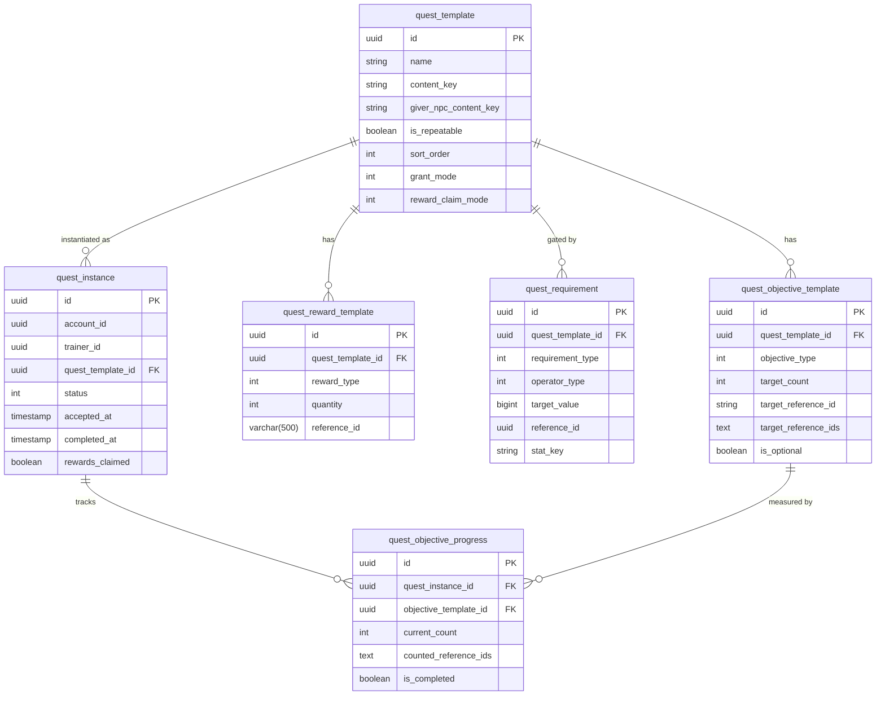

# Quest System

Quests are the primary structured progression mechanism in Crystalline Rift. The system separates read-only template data (content) from mutable instance data (player state), evaluates gating requirements, tracks per-objective progress, and writes lifetime stats as a side-effect of every progress event.

## Why This Design?

### Why Separate Templates from Instances?

A quest template is content — defined once by a designer, shared across all trainers. A quest instance is state — one trainer's active or completed run of that template. Keeping them in separate tables means the template table is essentially read-only after shipping content, and all write pressure goes to the instance and progress tables where it belongs.

This mirrors the Class/Object relationship: `quest_template` is the class, `quest_instance` is the object. The same template can produce many instances (for repeatable quests, one per repeat), each with its own accept time, progress counters, and reward state.

### Why `content_key` on Templates?

Quest templates carry a `content_key` (e.g. `"quest_talk_to_elder"`) for the same reason NPCs and spawners do — it bridges the backend database to Unity's `QuestDefinition` ScriptableObjects. The Unity client references quests by `content_key` to resolve display names, descriptions, and objective data from SOs without a live database read. `content_key` is globally unique across all quest templates.

The `giver_npc_content_key` column links a template to the NPC that offers it, using the same string key that appears on the NPC's `content_key` column. When a player opens an NPC's quest list, the client calls `GetAvailableQuestsForTrainerAsync(accountId, trainerId, npcContentKey, ct)` — the backend filters `quest_template.giver_npc_content_key = npcContentKey` to return only that NPC's quests.

### Why AND Logic for Requirements (No OR)?

Requirement evaluation uses strict AND semantics — all rows in `quest_requirement` for a given template must pass for the quest to become available. This covers the vast majority of gating scenarios (reach level X, complete quest Y, have item Z) while keeping `IConditionEvaluator` simple and deterministic. OR logic creates combinatorial evaluation paths that are harder to debug and harder for designers to reason about. If OR-style gating is needed, express it as separate quest templates gating a third template rather than OR rows in the same requirement list.

### Why Do Stat Writes Happen in the Quest Domain?

The Stats domain tracks lifetime career totals. The Quest domain is the subsystem that knows a meaningful player action occurred (a battle was won, a creature was captured). Rather than requiring the battle system or capture system to know about the Stats domain directly, `RecordProgressEventAsync` is the chokepoint — every action that advances a quest objective also represents a trackable career event. This avoids a dependency on Stats from every other domain and gives quest progress and stat writes the same transactional scope.

## Data Model


```mermaid
erDiagram
    quest_template {
        uuid id PK
        string name
        string content_key
        string giver_npc_content_key
        boolean is_repeatable
        int sort_order
        int grant_mode
        int reward_claim_mode
    }
    quest_objective_template {
        uuid id PK
        uuid quest_template_id FK
        int objective_type
        int target_count
        string target_reference_id
        text target_reference_ids
        boolean is_optional
    }
    quest_reward_template {
        uuid id PK
        uuid quest_template_id FK
        int reward_type
        int quantity
        varchar(500) reference_id
    }
    quest_requirement {
        uuid id PK
        uuid quest_template_id FK
        int requirement_type
        int operator_type
        bigint target_value
        uuid reference_id
        string stat_key
    }
    quest_instance {
        uuid id PK
        uuid account_id
        uuid trainer_id
        uuid quest_template_id FK
        int status
        timestamp accepted_at
        timestamp completed_at
        boolean rewards_claimed
    }
    quest_objective_progress {
        uuid id PK
        uuid quest_instance_id FK
        uuid objective_template_id FK
        int current_count
        text counted_reference_ids
        boolean is_completed
    }

    quest_template ||--o{ quest_objective_template : "has"
    quest_template ||--o{ quest_reward_template : "has"
    quest_template ||--o{ quest_requirement : "gated by"
    quest_template ||--o{ quest_instance : "instantiated as"
    quest_instance ||--o{ quest_objective_progress : "tracks"
    quest_objective_template ||--o{ quest_objective_progress : "measured by"
```

For full column descriptions see the table breakdowns in the sections below.

## Grant mode and reward claim mode

`M7017AddGrantAndClaimModeToQuestTemplate` adds two columns to `quest_template`:
`grant_mode INT NOT NULL DEFAULT 0` and `reward_claim_mode INT NOT NULL DEFAULT 0`. Both engines get
a plain `ALTER TABLE ... ADD COLUMN`; SQLite's `Down()` cannot drop a column pre-3.35 and leaves the
columns in place on rollback (harmless — every row already means "0" for both).

```csharp
public enum QuestGrantMode
{
    OfferedByGiver = 0,     // the giver NPC offers it in dialogue; the trainer must accept
    AutoWhenAvailable = 1,  // auto-grants the moment its requirements are satisfied, no offer needed
}

public enum QuestRewardClaimMode
{
    AutoOnCompletion = 0,   // rewards are claimed automatically once the quest's criteria are met
    ReturnToGiver = 1,      // the trainer must return to the giver NPC to claim them
}
```

The default (`0`/`0`) is exactly the behavior every quest had before this migration — `OfferedByGiver`
and `AutoOnCompletion` — so no existing content changed meaning when the columns were added.

Both modes are read by the client, not enforced server-side beyond the columns existing:

- **`AutoWhenAvailable`** — the Unity client's `QuestAutoGranter` sweeps the trainer's available
  quests on every session-ready signal and after every reward claim, and accepts every
  `AutoWhenAvailable` template that isn't already active for the trainer and isn't repeatable (a
  repeatable auto-grant quest would have nothing capping how many times it re-grants, so the sweep
  skips repeatable candidates outright — never grants them at all). See
  [Dialogue Authoring](?page=unity/32-dialogue-authoring) for the authoring-side warning this implies.
- **`ReturnToGiver`** — `QuestRewardDispatcher` claims a completed quest's rewards immediately
  *unless* the template is `ReturnToGiver` **and** names a `giver_npc_content_key`; a `ReturnToGiver`
  quest with no giver claims immediately too, same as `AutoOnCompletion` — a reward is never left
  permanently stranded waiting on a "return to" that can never happen. When it does wait, the reward
  is collected later either through the Quests tab's Claim button or a dialogue `quest.claim` action
  (see [Dialogue System](?page=unity/31-dialogue-system)).

`giver_npc_content_key` is authoritative for *both* modes: `AutoWhenAvailable` ignores it (nothing
about auto-granting a quest touches its giver), but `ReturnToGiver` reads it to decide whether there
is anywhere to return to.

## Quest categories and area key

Every quest has a **category** and an optional **area key**. Both are metadata only: no gate, grant,
requirement, reward or talent unlock reads them. Spec: `cr-api-unity/docs/superpowers/specs/2026-09-27-quest-categories-design.md`.

| Int | `QuestCategory` | Slug | Meaning |
|---|---|---|---|
| 0 | `Bonus` (default) | `bonus` | Side or optional content. Anything unauthored or legacy reads as Bonus, never as Main Story. |
| 1 | `MainStory` | `main_story` | The main story line. |
| 2 | `Exploration` | `exploration` | Reach places, find things. |
| 3 | `Battle` | `battle` | Win battles, defeat creatures or trainers. |
| 4 | `Talent` | `talent` | Unlocks or advances the talent tree, or teaches or shows a talent. |

The ints and slugs are permanent (`QuestCategoryValuesTests`). The player's display order is Main Story,
Exploration, Battle, Bonus, Talent. It lives in the clients (`QuestCategoryDisplay`, admin-web
`QUEST_CATEGORY_OPTIONS`), never in the ints.

**Columns.** `quest_template.category INTEGER NOT NULL DEFAULT 0` (M17001) and `quest_template.area_key VARCHAR(64) NULL`
(M17003). There is no CHECK constraint and no index. `area_key` holds an `AreaDefinition.areaKey` (`Meadow`, `Cave`, …), the same
key space as `world_location.area_key`. It is stored trimmed and compared case-insensitively. Both migrations guard `ADD COLUMN`
with `Column(...).Exists()` because SQLite's `Down()` keeps the column.

**Write rule (`PUT /api/v1/quests/templates/bulk`).** `category` and `areaKey` are nullable on the wire.
- `null` keeps what is stored. A new row gets Bonus / no area. This lets an older Studio or admin-web build push without resetting anything.
- An undefined category returns 400 `Undefined category {n} on template '{key}'.`
- `areaKey` is trimmed. `""` clears it, and more than 64 characters returns 400.
- The reads (`GET /templates`, `…/by-content-key/{k}`) return `category` as an **int** and `areaKey` as a string or null.

**Backfill (M17002).** It runs `UPDATE … SET category = n WHERE content_key = … AND category = 0`, so it is idempotent and never overwrites. On SQLite it is a no-op, because quest seeds skip SQLite and the SOs carry the same values.

| content_key | Category |
|---|---|
| `quest-welcome-to-cr` (retired by M7020, pending deploy), `quest-first-battle`, `quest-runaway-cargo` (Meadow Merchant Act 1) | Main Story |
| `quest-road-to-shore`, `quest-into-the-dark`, `quest-windbitten-climb`, `quest-sunbleached` | Exploration |
| `quest-meadow-hunt`, `quest-tidewrack-trials` | Battle |
| `quest-first-capture`, `quest-hearthmere-supplies` | Bonus |

There is no counter backfill for quests claimed before this release (the game is not live).

**Completion outcome.** The completion CAS emits `QuestCompleted` (#1 phase B). It carries
`Facts[Category]` (the slug) and, when set, `Facts[AreaKey]`, both read from the **server's** template row
(`ProgressOutcomeQuestFactsExtensions.WithQuestTemplateFacts`). A deleted template, or a stored category that
is not one of the five, adds no category fact — that completion still counts in `quests_completed`, just not
in any `quests_completed_cat_*` counter. The `LifetimeStatProjector` then writes `quests_completed` +1 and,
when the category fact is present, `quests_completed_cat_{slug}` +1 (`stat_event.source = "quest_complete"`),
once per won CAS, never at claim. See [Stats](08-stats-system.md) and [Achievements](15-achievements.md).

**Authoring.** Categories are set on the `QuestDefinition` SO (Category dropdown, and an Area popup over the World Location
Catalog's area keys) and pushed by Crystalline Rift Studio. The Studio Quests tab filters by category. Admin web edits both (Category
select, free-text Area key). The Content Audit window reports `quest-area-unknown` for an area key no catalog location
uses. A `VisitLocation` objective's target is likewise picked from `ContentPicker.WorldLocations()` (a
`QuestDefinitionEditor` popup, never free text) — a target missing from the catalog fires the separate
`visit-location-target-uncatalogued` audit rule, since the authority advances nothing for a key it cannot
resolve; see [Location Discoveries](?page=backend/24-location-discoveries).

**Supersedes checklist step 0b's `quest_kind`.** Main Story means "main", and every other category is a side quest. Only
`quest_line` / `line_step` remain planned.

## The shipped quest chain

Eight quests (M7014) follow the habitat level ladder, so "where do I go next" is answered by a quest
rather than by walking into a habitat twenty levels above you. Each gates on the one before it; the
middle rungs also gate on creature level.

M7014 also seeds **First Battle** (`quest-first-battle`), the quest the first three rungs require.
It is authored as a QuestDefinition and synced into the client's SQLite at world init, but nothing
seeded it into Postgres — so on a fresh deployment the prerequisite did not exist, could never be
completed, and the three meadow quests were filtered out of the available list forever.

That seed was added by amending M7014 in place, which only helps a database created after the
amendment — `version_info` on a server that had already run M7014 still records it as applied, so the
fix never re-runs there and the three meadow quests stayed permanently unofferable. `M7016SeedFirstBattleOnMigratedDatabases`
(Postgres only, the same guarded statements) is the forward repair for those servers.

| Quest | Area | Objectives | Requires | XP / gold |
|---|---|---|---|---|
| Thin the Meadow | Meadow | defeat 5 creatures | First Battle | 150 / 60 |
| A Second Companion | Meadow | capture any creature | First Battle | 150 / 60 |
| Supplies for Hearthmere | Village | visit Hearthmere, talk to the trader | First Battle | 120 / 100 |
| The Road to the Shore | → Shore | reach the Shore | Thin the Meadow | 250 / 100 |
| Tidewrack Trials | Shore | win 8 battles | Road to the Shore, creature ≥ 6 | 600 / 220 |
| Into the Dark | Cave | enter the Cave, defeat 10 | Tidewrack Trials, creature ≥ 10 | 1,200 / 400 |
| The Windbitten Climb | Crags | reach the Crags, raise a creature to 18 | Into the Dark | 2,200 / 700 |
| Sunbleached | Dunes | reach the Dunes, raise a creature to 25 | Windbitten Climb | 4,500 / 1,500 |

Rewards are sized against the re-curved experience table at roughly one to two levels' worth *at the
level the quest is meant for* — 150 in the meadow where a level costs about 90, 4,500 in the dunes.

Three things this chain depends on, each of which was a trap:

- **`VisitLocation` needs a trigger in the scene.** `LocationTriggerBehaviour` existed, complete and
  injected, and was placed in exactly zero scenes — so every VisitLocation objective was unreachable
  and every location achievement unwinnable. `cr_polish_areas` now puts one in each area, sized to
  the whole playable space and keyed to the area key.
- **Prerequisites must sync before their dependants.** `LocalQuestTemplateSyncClient` resolves a
  requirement's `referenceId` from a content key to the template's database id by looking it up — and
  if it is not there yet it warns and stores **null**, which reads as "no prerequisite". The order of
  `ContentDefinitionProvider.quests` is therefore load-bearing; the chain is registered in dependency
  order.
- **The server resolves the same key on push (2026-10-01).** `PUT /api/v1/quests/templates/bulk` used to
  keep only what `Guid.TryParse` accepted and store **null** for a QuestCompleted requirement authored
  as a content key — which `ConditionEvaluator` compares against completed template ids, so Runaway
  Cargo and First Battle 409'd `requirements_not_met` for every online player. `QuestEndpoints.
  ResolveRequirementsAsync` now resolves a QuestCompleted key to the template id — this push's authored
  ids first (order on the wire does not matter), then the stored row — and an unresolvable key refuses
  the whole push with `400 invalid_requirement` instead of silently storing a gate nobody can open.
  Other requirement types still take a Guid reference as before.
- **The seed ids are UUIDv5 of the content key**, matching what the authored assets carry. A seed
  with an id of its own is discarded the moment Crystalline Rift Studio pushes the asset — the unique index is
  on `content_key`, so the row already exists and every objective and reward hangs off a template
  nothing points at.

:::caution
The quest seed is **Postgres only**. M7012 deleted the earlier M7006/M7008 seeds out of SQLite
because migration rows there go stale against the designer-authored assets, and the client syncs
every SO in `ContentDefinitionProvider.quests` into local SQLite at world init. Seeding SQLite from a
migration rebuilds exactly the divergence M7012 exists to remove.
:::

### The onboarding quest has two ids in history — only one is live

`M7008_SeedWelcomeToCRQuest` seeded an onboarding quest under `content_key = "quest_welcome_to_cr"`
(underscore), id `F0E1D2C3-…`. That quest is **not** the one anything in Unity grants — it predates
the `QuestDefinition` ScriptableObject rewrite of onboarding and was superseded by a hand-authored SO
(`Assets/CR/Content/Defs/Quests/Starter Quest.asset`, `content_key = "quest-welcome-to-cr"`, hyphen,
id `f1921cfd-26a0-4b70-b45f-0e28a58fb7e1`) that Crystalline Rift Studio pushed to Postgres directly — never
through a migration. `M7008`'s row has since been manually removed from dev/prod Postgres (Studio
deletes aren't migration-tracked, so `VersionInfo` still shows `M7008` as applied even though its row
is gone).

Because nothing ever baked the **live** quest, a fresh Postgres deployment (new environment, CI, a
teammate's first `docker compose up`) had no server-side row for `quest-welcome-to-cr` at all — the
identical id/content_key existed only in every player's local SQLite (synced from the SO at every
world init), so `AcceptQuestAsync` online would 404/fail on the FK the moment anyone actually tried it
there. `M7015_SeedLiveWelcomeToCRQuest` fixes this: it seeds the SAME id/content_key/objective/reward
the SO carries, Postgres only (SQLite already gets this from the SO sync — seeding it there too would
recreate the exact divergence M7012 removed), guarded so a Crystalline Rift Studio push that already fully
authored the template (parent row **and** its own objective/reward children) is left completely
alone — the guard checks "does this template have any children yet", not just "does a child with my
own hardcoded id exist", so it never bolts a duplicate objective/reward onto an already-authored
template. Covered by `WelcomeQuestSeedPostgresTests` / `WelcomeQuestSeedGuardPostgresTests` in
`Convenience/CR.Data.Migrations.Test`.

:::note
Investigating this also surfaced that `quest_objective_template` / `quest_reward_template` carry
**eight duplicate rows** each for the live `quest-welcome-to-cr` template in dev Postgres — repeated
Crystalline Rift Studio pushes insert new child rows instead of upserting against existing ones (unlike the
parent `quest_template` row, which IS matched by `content_key`). This is a separate, still-open bug in
the Crystalline Rift Studio push path (`PUT /api/v1/quests/templates/bulk` → `UpsertTemplateWithChildrenAsync`,
step 4/6 in the walkthrough above soft-deletes *all* existing children before re-inserting, which
should be idempotent — the duplicates predate that soft-delete-then-insert design and were never
cleaned up). Not fixed here: live `quest_objective_progress`/`quest_instance` rows for existing
trainers may reference specific one of the eight objective/reward ids, so cleanup needs its own
FK-safe migration. Flagging for a follow-up rather than touching production data as a side effect of
this fix.
:::

### Welcome is retired (M7020)

:::note Pending deploy (cr-api feature/retire-welcome)
Not merged to main and not deployed. The Unity half (parking the Welcome asset, removing First
Battle's requirement from its asset, offline trainer creation) is also pending.
:::

The starter creature and the two `item_heal_potion_30` are now granted at trainer creation by
`TrainerCreationService` (see [Starter Creature Flow](?page=backend/05-starter-creature-flow)), so
Welcome's creature reward would be a second starter. `M7020RetireWelcomeQuest` (Quests, both
engines; `isSqlite` boolean literals, `LOWER()` id matching on SQLite, every statement guarded by
`deleted = false`, so a re-run is a no-op) retires it:

- **Soft-deletes** every `quest_requirement` of type QuestCompleted (`requirement_type = 0`) whose
  `reference_id` is Welcome — First Battle's requirement — and Welcome's own requirement, objective
  and reward rows, then the `quest-welcome-to-cr` template. Welcome is matched by content key **and**
  by the authored id `f1921cfd-26a0-4b70-b45f-0e28a58fb7e1`, so a requirement left pointing at the id
  with no template behind it goes too.
- **First Battle** has no requirement left, so it is the first story quest and, with `grant_mode = 1`
  (AutoWhenAvailable, unchanged, matching the asset), is granted to every trainer at once. Its giver
  moves from `demo-questgiver-area-1` (M14002's value) to Philroe, `demo-merchant-area-1`, as First
  Battle.asset authors it. Only a row still holding M14002's value moves; a giver pushed from the
  Studio since then is left alone.
- **Fresh databases.** On a fresh Postgres database Quest migrates before Dialogue, so M14002 runs
  after M7020 and would set the old giver again. M14002's entry for First Battle was therefore edited
  to `demo-merchant-area-1` as well. Databases that already applied 14002 never re-run it, which is why
  M7020 carries the move. M14002 is Postgres-only, so SQLite is unaffected.
- **Leaves alone** `quest_instance` and `quest_objective_progress` history. `Down()` is a documented
  no-op: rows soft-deleted before the migration cannot be told apart from the ones it deleted.
- **Nothing resurrects it.** M7008 is a different key (`quest_welcome_to_cr`); M7014/M7015/M7016 guard
  on the row existing (soft-deleted included) and run earlier; M14002 and M17002 only UPDATE. A Studio
  push of the parked Welcome asset fails loudly with a primary-key conflict (the upsert finds no live
  row by content key and INSERTs under the authored id) rather than reviving it. Studio sync must
  still exclude `Defs/_Parked/`: a push of an old First Battle asset that carries the requirement
  would add it back.

**Stranded instances.** A trainer who holds an in-progress Welcome instance keeps it. Its objectives
now read as empty, so the projector never marks it relevant and it never completes; a claim would
pay nothing, because `GetRewardTemplatesAsync` filters deleted rows; `GetObjectiveProgressRelinkedAsync`
makes no writes for it. The instance still appears in `GetActiveQuestsAsync`, so the client should
hide instances whose template is gone (Unity half, pending).

Tests: `RetireWelcomeQuestMigrationTests` (Quests.Data.Test, SQLite + Postgres, including
`FirstBattle_MovesFromTheM14002GiverToPhilroe` and `FirstBattle_AGiverPushedSince_IsLeftAlone`),
`WelcomeQuestSeedPostgresTests` and `M14002SeedPostgresTests` (updated to the retired state).

## How to Define a New Quest (Step-by-Step)

### Step 1: Create the migration

Name the migration file with the next migration number and a descriptive suffix:

```csharp
[Migration(7010)]
public class M7010_AddBattleTrialQuest : FluentMigrator.Migration
{
    private const string TemplateId    = "11111111-0000-0000-0000-000000000001";
    private const string Objective1Id  = "22222222-0000-0000-0000-000000000001";
    private const string RewardId      = "33333333-0000-0000-0000-000000000001";

    public override void Up()
    {
        var isSqlite = ConnectionString.ToLower().Contains("data source") ||
                       ConnectionString.ToLower().Contains("sqlite");

        if (isSqlite)
        {
            Execute.Sql($@"
                INSERT OR IGNORE INTO quest_template
                  (id, name, description, content_id, content_key, giver_npc_content_key,
                   is_repeatable, max_repeat_count, sort_order, deleted, created_at, updated_at)
                VALUES
                  ('{TemplateId}', 'Battle Trial', 'Win 3 battles to prove your worth.',
                   '{TemplateId}', 'quest_battle_trial', 'kael_trainer_npc',
                   0, 0, 10, 0, datetime('now'), datetime('now'))
            ");
            Execute.Sql($@"
                INSERT OR IGNORE INTO quest_objective_template
                  (id, quest_template_id, objective_type, description,
                   target_count, target_reference_id, target_metadata,
                   is_optional, sort_order, deleted, created_at, updated_at)
                VALUES
                  ('{Objective1Id}', '{TemplateId}', 3, 'Win 3 battles',
                   3, NULL, NULL,
                   0, 1, 0, datetime('now'), datetime('now'))
            ");
        }
        else
        {
            Execute.Sql($@"
                INSERT INTO quest_template
                  (id, name, description, content_id, content_key, giver_npc_content_key,
                   is_repeatable, max_repeat_count, sort_order, deleted, created_at, updated_at)
                VALUES
                  ('{TemplateId}', 'Battle Trial', 'Win 3 battles to prove your worth.',
                   '{TemplateId}', 'quest_battle_trial', 'kael_trainer_npc',
                   false, 0, 10, false, now(), now())
                ON CONFLICT (id) DO NOTHING
            ");
            Execute.Sql($@"
                INSERT INTO quest_objective_template
                  (id, quest_template_id, objective_type, description,
                   target_count, target_reference_id, target_metadata,
                   is_optional, sort_order, deleted, created_at, updated_at)
                VALUES
                  ('{Objective1Id}', '{TemplateId}', 3, 'Win 3 battles',
                   3, NULL, NULL,
                   false, 1, false, now(), now())
                ON CONFLICT (id) DO NOTHING
            ");
        }
    }

    public override void Down()
    {
        Execute.Sql($"DELETE FROM quest_objective_template WHERE quest_template_id = '{TemplateId}'");
        Execute.Sql($"DELETE FROM quest_template WHERE id = '{TemplateId}'");
    }
}
```

Key points:
- `objective_type` = 3 is `WinBattles` (see enum table below)
- `target_count` = 3 means the player must win 3 battles
- `giver_npc_content_key` must match the `content_key` of an existing NPC or be `NULL` for world quests
- Use `0`/`false` for booleans (engine-aware as shown)
- Always provide a `Down()` that cleans up seed data

### Step 2: Create a `QuestDefinition` ScriptableObject in Unity

In the Unity editor, right-click in the Project window and select **Create → CR → Quest Definition**. Fill in the inspector fields:

| Field | Value |
|-------|-------|
| `contentKey` | `"quest_battle_trial"` — must match the migration exactly |
| `questName` | `"Battle Trial"` |
| `description` | `"Win 3 battles to prove your worth."` |
| `giverNpcContentKey` | `"kael_trainer_npc"` |
| `isRepeatable` | false |
| `objectives[0].objectiveType` | `WinBattles` |
| `objectives[0].description` | `"Win 3 battles"` |
| `objectives[0].targetCount` | 3 |

The SO is the Unity-side source of truth for display data. The `content_key` must match the database row exactly. Push the template to the server with **Crystalline Rift Studio → Quests → ⬆ Push All** (`PUT /api/v1/quests/templates/bulk`) rather than writing a separate migration for the template row — the migration is only needed for seed data in environments without the editor.

### Step 3: Add a requirement (optional)

To gate the quest behind another quest being completed:

```sql
-- Postgres
INSERT INTO quest_requirement
  (id, quest_template_id, requirement_type, operator_type,
   target_value, reference_id, stat_key, deleted, created_at, updated_at)
VALUES
  (gen_random_uuid(), '<TemplateId>', 0, 0,
   1, '<PrecedingQuestTemplateId>', NULL, false, now(), now());
-- requirement_type 0 = QuestCompleted, operator_type 0 = GreaterThanOrEqual, target_value 1 = at least 1 completion
```

## How to Advance a Quest Objective from Unity

:::caution `POST /api/v1/quests/progress` is retired (Phase E, 410 `route_retired`)
This section used to describe the pre-server-authority `POST /api/v1/quests/progress` contract. Phase
E deleted the whole compat vertical — `IQuestDomainService.RecordProgressEventAsync`/
`ForwardTalkAsync`/`ForwardVisitLocationAsync`, `QuestProgressCompat`, and (cr-api-unity)
`IQuestRepository.RecordProgressAsync`/`IQuestClient.RecordProgressAsync` and their
`QuestClientUnityHttp`/`QuestOnlineOfflineRepository` implementations — there is no client method left
that calls this, and the route itself answers 410 regardless of `objectiveType`. Every objective now
advances through the real intent that produces it, never a client-reported progress event:
- `TalkToNpc` → the talk intent, `NpcTalkService` (via `POST /api/v1/trainers/{t}/npcs/{npcKey}/talk`)
- `VisitLocation` → `POST /api/v1/trainers/{t}/world-locations/enter`
  (`LocationEntryService.EnterAsync`) — see [Location Discoveries](?page=backend/24-location-discoveries)
- Every battle/defeat/capture/item/quest-completion type → produced by the authority itself
  (`BattleDomainService`, `ItemUseDomainService`, `QuestDomainService.ClaimRewardsAsync`, …) and
  reported via [Progress Dispatcher](?page=backend/23-progress-dispatcher), never posted by the client

`ProgressReportQuestExtensions.ToQuestProgressResultAsync` and the `QuestProgressResult`/
`QuestProgressEvent` DTOs below are the one piece of the old vertical still standing — kept because
`ClaimRewardsAsync` still uses them to shape its own response, not because anything posts progress
through them any more.
:::

If every required objective is now complete, `newStatus` becomes `"Completed"` and `isCompleted` becomes `true`. The Unity client inspects `newStatus` to trigger the quest-complete celebration animation and enable the reward claim button.

A battle win, a capture, an item use or a quest completion is never reported this way — see the compat
translator section below for what each objective type now does.

## Reading Quests from Unity (the quest journal)

Game code never touches `IQuestClient` or `IQuestDomainService` directly. Everything goes through
`QuestManager`, which holds the session (`SetSession(accountId, trainerId)`) and delegates to
`IQuestRepository` — the online/offline router (`QuestOnlineOfflineRepository`).

Read surface used by the player menu's **Quests** tab (`Assets/CR/UI/Quests/QuestJournalView.cs`):

| `QuestManager` method | Routes to | Notes |
|---|---|---|
| `RefreshActiveQuestsAsync(ct)` | `IQuestRepository.GetActiveQuestsAsync` | Re-reads InProgress instances, replaces the in-memory list seeded by `QuestWorldBehaviour`, then raises `OnActiveQuestsRefreshed`. |
| `GetCompletedQuestsAsync(ct)` | `IQuestRepository.GetCompletedQuestsAsync` | Completed instances. |
| `GetTemplateAsync(templateId, ct)` | `IQuestRepository.GetQuestTemplateAsync` | Name, description, objective texts, rewards. |
| `AbandonQuestAsync` / `ClaimRewardsAsync` | as before | Unchanged lifecycle calls. |

The Quests tab groups both sections (Active and Completed) by category in display order and hides empty groups. Each header
reads, for example, "Main Story · 2", and each group keeps the section's own order. The HUD tracker shows the category as a small
label above each card's title (`quest-tracker__category`). The tracker's order is unchanged (authored `SortOrder`).

`QuestManager` also exposes `AccountId`, `TrainerId`, and `HasSession` so a UI can decline to load
before world init has run rather than throwing out of `AssertSession`.

For code driven by gameplay events that can fire *before* world init finishes, `QuestManager.WhenReady`
is a `Task` that completes when `LoadActiveQuests` seeds the manager at the end of
`QuestWorldBehaviour.InitializeAsync`. `QuestGranterBehaviour` awaits it (120 s timeout) before
resolving a quest's template: its `OnTrainerSelected` trigger fires at character select, but the local
`quest_template` tables are only synced during the world bootstrap that follows — an ungated grant
looked up the template too early, found nothing, and the quest (and its rewards, e.g. the welcome
quest's starter creature) was silently never accepted.

**`WhenReady` is per-session, not a one-shot flag.** It used to be a bare `TaskCompletionSource` that
was only ever completed once — which protected exactly the *first* trainer selected in a process, and
nothing after it. Every trainer selected later in the same run saw `WhenReady` already `IsCompleted`
(stale, left over from the previous trainer's session) and skipped the wait entirely, racing
`QuestWorldBehaviour.InitializeAsync` for its own session. Symptom: switching from offline play to a
second/subsequent online trainer silently dropped the auto-granted "Welcome To CR" quest (and its
creature reward) — no error, no server request, just `[QuestGranterBehaviour] No template found for
contentKey='quest-welcome-to-cr'` in the log, timestamped well before that trainer's own
`QuestWorldBehaviour.InitializeAsync` had even started. Fixed by extracting the gate into
`QuestSessionReadyGate` (`Assets/CR/Quests/Manager/Logic/QuestSessionReadyGate.cs`, engine-free,
unit tested) and adding `QuestManager.BeginSession()`, which resets the gate to a fresh, incomplete
state whenever it's already signalled ready. `CharacterSelectController.SelectAsync` calls
`BeginSession()` as the very first statement — before `SetTrainerAsync`, before `EnterOverworld`,
before the `OnTrainerSelected` event that `QuestGranterBehaviour` reacts to — so no later trainer
selection can observe a stale gate.

### "New quest" toast and dedup

`QuestManager.OnQuestGranted` fires the first time this session becomes aware of a quest instance
that was not already active for the trainer when the session started — regardless of how it became
active:

- auto-granted on trainer select (`QuestGranterBehaviour` → `AcceptQuestAsync`)
- accepted from a dialogue node (`QuestDialogueBridge.HandleQuestAccepted` → `AcceptQuestAsync`)
- discovered purely server-side on a later sync (`RefreshActiveQuestsAsync`, e.g. opening the
  Quests tab after the server granted something the client never requested)

Dedup is `QuestToastPolicy` (`Assets/CR/Quests/Manager/Logic/QuestToastPolicy.cs`, engine-free, unit
tested): `LoadActiveQuests` establishes a baseline of the trainer's already-active instance ids
*before* completing the ready gate, so a quest re-observed on every subsequent
`RefreshActiveQuestsAsync` call (the Quests tab reloads every time it's opened — see
`PlayerMenuWindow.LoadTab`) toasts at most once per instance id, ever, for the life of the process.
`AchievementToastPresenter` (despite the name — see `docs/backend/15-achievements.md`) subscribes to
`OnQuestGranted` and shows `"New quest: {name}"` through the same toast queue as achievement unlocks
and `WorldToast`. The quest journal (`QuestJournalView`) needs no separate live-update wiring for
this — `PlayerMenuWindow` already reloads every tab's data on every open/tab-switch, so a newly
granted quest is picked up the next time the Quests tab renders.

### Authored template ids are authoritative

A `QuestDefinition` SO's `id` is the content GUID mirrored by the server's `quest_template` row.
`LocalQuestTemplateSyncClient` passes it through, and `UpsertTemplateWithChildrenAsync` honors it:
a fresh insert uses the authored id, and an existing row born under a minted id is **re-keyed** to
the authored id (children, cross-quest `quest_requirement.reference_id` references, and — where the
table exists in the same database — `quest_instance` rows all follow; no FK constraints reference
`quest_template`, so ordering is free and the operation is idempotent). Without this, online accept
resolved the template from the local DB and sent the server a minted id it had never seen — a
400 Bad Request and a quest that never started. An empty caller id keeps the old
keep-existing/mint-new behavior.

### The accept intent is keyed by `content_key`, never by template id

Authored ids *should* match, but the game must not depend on it: production's
`quest-runaway-cargo` row was minted under `c241235f…` while every client bakes the SO id
`7c3e9a1d…` from `Runaway Cargo.asset`, and the id-keyed accept answered
`400 "Quest template 7c3e9a1d-… not found."` for a quest the server plainly had. The fix lives on
both sides of the seam:

- **Server:** `POST /api/v1/quests/by-content-key/{contentKey}/accept` →
  `IQuestDomainService.AcceptQuestByContentKeyAsync`. Same guard (`RequirePlayerTrainer`), same
  idempotency key, same rules as the id route (requirements evaluated, idempotent, abandoned instance
  restarts); the server resolves *its own* row by key. The id route stays for tooling and wire
  compatibility.
- **Client:** `IQuestService.AcceptQuestAsync(string questContentKey)` is the only accept. Every
  caller already holds the key — `QuestGranterBehaviour` (the SO's `contentKey`), `QuestAutoGranter`
  (the server's available list), `QuestAcceptActionHandler` (the dialogue arg), `PickupBehaviour`
  (the reward's `ReferenceKey`). The legacy Lua hook (`QuestDialogueBridge`) resolves its UUID to a
  template first. `QuestOnlineOfflineRepository.AcceptQuestAsync` sends the key online and hands the
  same key to the local `QuestDomainService` offline — the same boundary, the same code.
- **Reads:** an online instance names the *server's* template id. When the local content has no row
  under that id, `QuestOnlineOfflineRepository.GetQuestTemplateAsync` answers from the server via
  `ServerQuestTemplateIndex` (one `GET /templates` per session for id → key, then
  `GET /templates/by-content-key/{key}` for the full template, every answer cached) — in the
  server's id namespace, objective ids included, so the journal, tracker and reward dispatcher join
  instance ↔ template ↔ objective progress whatever the ids are. Nothing local is rewritten.
- **Studio push realigns prod:** `UpsertQuestTemplateRequest.Id` (nullable, last) carries the SO's id;
  `QuestEditorSyncHelper.BuildUpsertBody` sends it. The repository re-keys a minted row as described
  above (instances follow, no FKs), so one "Push" of a diverged quest from Studio makes the server's
  id match the content's. Pushes without an id (older Studio, cr-admin-web) keep the stored id.
- **Objective ids (M7019, pending deploy — cr-api feature/retire-welcome; it re-keys ids):** templates realign by push, objective rows never did — the upsert keeps
  the live row at a sort order and never rewrites its id, so a prod objective minted before
  `QuestObjectiveTemplateIds.Derive(templateId, sortOrder)` kept its old id while every client's
  local template carries the derived one. The template ids matched, so the server-template fallback
  above never kicked in, and every progress report named an objective the client's template did not
  have: the HUD tracker stayed at 0/N after a capture (Runaway Cargo) until a journal refresh let the
  local re-link heal the row. `M7019AlignObjectiveTemplateIdsToDerived` (Quests, both engines,
  `ObjectiveTemplateIdAlignment`) re-keys every live objective row to its derived id and repoints
  `quest_objective_progress.objective_template_id`. It is a **two-phase re-key**, so the result does
  not depend on row order: rows are read in a fixed order (template, sort order, id); one live
  claimant is picked per (template, sort order) target; a claimant whose derived id is held by a live
  row that is not itself moving (correctly keyed, or a skipped duplicate) is dropped, repeated until
  stable, so no row is left on a temporary id; then, in one transaction, every chosen row and its
  progress rows move to a temporary id and from there to the derived id. That resolves **chains**
  (Y's target is held by X, which has a free target) and **swaps** (X holds Y's derived id and Y holds
  X's). A soft-deleted row squatting on a derived id is moved aside first; a duplicate claimant, or a
  target held by a correctly keyed live row, is skipped with a `[M7019] WARNING` line. Idempotent; one
  `[M7019]` line per re-key. Later seeds (M14002) address objectives by content key + sort order,
  so the re-key does not strand them. Pinned by `ObjectiveTemplateIdAlignmentTests` (SQLite + Postgres,
  18 cases, including `Chain_BlockedRowReadFirst_IsRekeyedOnceHolderMoves` and
  `Swap_EachHoldingTheOthersDerivedId_IsResolved`).

### Quest endpoints are token-authoritative for the account

Every trainer-facing quest handler derives the account from the Bearer token
(`HttpContext.GetAccountId()`), never from the client-supplied accountId (the body/query fields
remain for wire compatibility but are ignored). A client carrying a stale stored account id —
seen live after a server reset — used to write quest instances under an account that no longer
existed, splitting quest state from the trainer ("no quests, no creatures"). The auth responses
(`/auth/game`, `/auth/basic`, `/auth/oauth`) now return `accountId`, and the Unity client
overwrites its stored account id from that value on every successful authentication
(`GameAuthRepository.PersistAccountTokenLocally`). Pinned by
`CR.Api.IntegrationTests.QuestIdentityHttpTests` (bogus body accountId must not be persisted;
auth must echo the account id).

A token that passes the fallback authentication policy but carries no account claim is an
authorization problem, not a server fault: every quest handler now catches
`UnauthorizedAccessException` from `GetAccountId()` and returns `401 Unauthorized`, where it
previously fell through to the generic `catch (Exception)` and answered `500`.

### Why those two reads do not branch on connectivity

`GetActiveQuestsAsync` is the only read that has a server endpoint; the two added reads are answered
locally in **both** modes, deliberately:

- **Completed instances** — there is no `/completed` REST endpoint. The router already mirrors every
  server-returned instance into the local `quest_instance` table (active fetch, `/progress` results,
  claim results), so online play reads its own mirror instead of inventing a round-trip with nothing
  to call.
- **Templates** — templates are *content*, not player state. `QuestWorldBehaviour` syncs every
  `QuestDefinition` SO into the local `quest_template` tables at world init regardless of
  connectivity, so the local domain service is the correct source in either mode and costs no
  network hop.

### Instance vs template in the UI

A `QuestInstance` carries only IDs, status and counts. Objective *text* lives on
`QuestObjectiveTemplate`, so the journal pairs each `QuestObjectiveProgress` row to its template by
`ObjectiveTemplateId`. An objective with no progress row yet (progress never recorded) still renders,
at zero — so the player sees the full task list the moment they accept.

The instance repositories select instance columns only, so `QuestDomainService` attaches the rows on
every instance read — `GetActiveQuestsAsync`, `GetCompletedQuestsAsync` and `GetQuestInstanceAsync`
all populate `QuestInstance.ObjectiveProgress` (via `GetObjectiveProgressRelinkedAsync`) before
returning. Online, the Unity router mirrors exactly what `GET /api/v1/quests/active` and
`GET /api/v1/quests/{instanceId}` return into the local cache, so a read that leaves the list empty
renders every objective at 0/N even though the authority already counted it (post-launch fix,
2026-10-01: the Runaway Cargo capture was logged `1/3` by the projector while both reads answered
`"objectiveProgress": []`). If the template read fails for one instance, that instance is returned as
stored (empty list) and the trainer's other quests are unaffected.

Roll-up maths and the "may this quest be claimed" rule are **not** in the view: they live in the
engine-free `CR.UI.Logic` assembly (`QuestProgressCalculator`, `QuestActionPolicy`) and are unit
tested. Optional objectives never hold the headline progress bar back, and `CanClaim` requires
`Completed && !RewardsClaimed` — claiming grants rewards, so a double claim is the failure that
matters.

> Note: `QuestRewardDispatcher` auto-claims on `OnQuestCompleted`, so most completed quests already
> have `RewardsClaimed = true` by the time the journal opens and correctly show no Claim button. The
> button exists for instances whose auto-claim did not land.

## Quest Lifecycle

```
Available
  │  AcceptQuestAsync
  ▼
InProgress
  │  RecordProgressEventAsync (auto-transitions when all required objectives complete)
  ▼
Completed ─── ClaimRewardsAsync ──► rewards_claimed = true
  │
  │  (also valid from InProgress)
  ▼
Abandoned  (AbandonQuestAsync)
```

**Available** — a quest is available when:
- The trainer has no active (InProgress) instance of this template
- The template is not already completed, OR `is_repeatable = true` and `repeat_number < max_repeat_count` (or `max_repeat_count = 0`)
- All `quest_requirement` rows evaluate to true (AND logic); if there are no requirement rows the quest is ungated

**InProgress** — created by `AcceptQuestAsync`. A matching `quest_objective_progress` row is created for every non-deleted objective template at accept time.

`AcceptQuestAsync` is **idempotent**: a non-repeatable template with any existing instance (any
status) returns that instance instead of creating another, and a repeatable template only
re-accepts when no instance is currently in progress. This matters because scene auto-granters
(`QuestGranterBehaviour`) re-fire every session — before the guard, a non-repeatable quest
stacked one instance per boot, and a single progress event then completed every copy in one
serial claim burst (seen live: 38 stacked "Welcome To CR" instances ≈ a 10-second freeze).

**Accepting again also restarts an abandoned or failed instance**, rather than just handing the same
dead instance back. A non-repeatable template's one allowed instance can be one the player walked
away from (`Abandoned`) — it is still listed as available (only `InProgress` and `Completed`
instances hide a quest from the available list), so returning it untouched made the quest
un-takeable forever: offered, accepted once, abandoned, and never again. `RestartInstanceAsync`
zeroes every objective's progress first and sets the instance status to `InProgress` last, so an
interruption mid-restart leaves it `Abandoned` (and still restartable) rather than `InProgress` with
stale progress on it. This also means an `AutoWhenAvailable` quest is, in effect, not abandonable —
the client's auto-grant sweep re-accepts it on its next pass, restarting it from zero.

**Completed** — `RecordProgressEventAsync` increments matching progress rows, then checks whether every non-optional objective has `is_completed = true`. If so, the instance status transitions to `Completed` automatically.

**Claimed** — `ClaimRewardsAsync` sets `rewards_claimed = true` and increments the `quests_completed` lifetime stat. Double-claim throws.

**Abandoned** — `AbandonQuestAsync` sets status to `Abandoned`. Instance is retained for audit.

### Repeatable Quest Reset

When `is_repeatable = true`, a trainer can accept the same template again after completing it:

1. Trainer completes run 1 → instance `repeat_number = 1`, status = Completed
2. `ClaimRewardsAsync` sets `rewards_claimed = true`
3. The template reappears in `GetAvailableQuestsForTrainerAsync` because no active instance exists and the template is repeatable
4. Trainer accepts again → new instance created with `repeat_number = 2`
5. **Progress rows start at 0 for the new instance** — the previous instance's progress is not carried over

**What fields are cleared:** The old `quest_instance` is not modified — it is left as Completed/claimed as an audit record. A new `quest_instance` row is created with `repeat_number` incremented. The old `quest_objective_progress` rows belong to the old instance and are left untouched. New progress rows start at `current_count = 0`.

`max_repeat_count = 0` means unlimited repeats. Once the cap is reached, the template is excluded from available quests.

## Enums

### `QuestObjectiveType`

| Value | Int | Description |
|-------|-----|-------------|
| `DefeatCreature` | 0 | Defeat a specific creature (matched by `target_reference_id`) |
| `DefeatAnyCreature` | 1 | Defeat any creature; `target_reference_id` is ignored |
| `DealDamageOfType` | 2 | Deal damage using a specific type; `target_reference_id` = damage type |
| `WinBattles` | 3 | Win any battle encounters |
| `CaptureCreature` | 4 | Capture a specific creature (matched by `target_reference_id`) |
| `CaptureAnyCreature` | 5 | Capture any creature; `target_reference_id` is ignored |
| `DealDamage` | 6 | Deal any amount of damage |
| `HealAmount` | 7 | **Retired** (phase B): nothing produces heals; the template route and Studio refuse it |
| `ReachCreatureLevel` | 8 | Raise a creature to a specific level |
| `DefeatCreaturesFromList` | 9 | Defeat N DISTINCT species from `target_reference_ids` (each listed species counts once; `target_count` defaults to the list length, "all of them") |
| `VisitLocation` | 10 | Travel to a named location |
| `TalkToNpc` | 11 | Interact with a specific NPC |
| `CollectItem` | 20 | Collect a specific item |
| `CompleteQuest` | 30 | Complete another quest (used for chain objectives) |
| `DefeatTrainer` | 40 | Win against a specific trainer (`target_reference_id` = trainer battle content key; rematches count, a blank target means any trainer) |
| `DefeatAnyTrainer` | 41 | Win any trainer battle |
| `DefeatTrainersFromList` | 42 | Defeat N DISTINCT trainers from `target_reference_ids` |
| `ReachTalentRank` | 50 | Reach a rank in a talent (the "teach a talent" gate, [Talents §8.3](25-talents.md#quest-tie-in)); `target_reference_id` = talent content key, blank matches the highest rank on any talent |

**List objectives (9, 42)** store their targets as a JSON array in `quest_objective_template.target_reference_ids`
and the targets already counted in `quest_objective_progress.counted_reference_ids` (M7018, both engines,
nullable TEXT so every older seed still inserts). Both are exposed as `List<string>` on the models
(`TargetReferenceIds` / `CountedReferenceIds`) over an internal JSON-backed property; `QuestObjectiveTargets`
parses NULL, blank or malformed JSON as an empty list and never throws. On each event the service adds the key to
the counted set only if it is in the list (trimmed, case-insensitive), then sets `current_count` to the size of
the overlap between the counted set and the list AS IT IS NOW, capped at `target_count`: an author editing the
list mid-quest never strands progress, and the same target twice never advances. `evt.Amount` is ignored for list
types (one defeat is one target). Restarting an instance clears the counted set. Concurrent list events for one
objective race the read-modify-write; the next event recomputes the count from the list. On
`PUT /templates/bulk`, an objective's `targetReferenceIds` is optional: `null` keeps the stored list, `[]` clears
it, and a list type's `targetCount` is clamped to `1..list.Count`.

### `QuestRequirementType`

| Value | Int | Evaluated by |
|-------|-----|--------------|
| `QuestCompleted` | 0 | Checks `quest_instance` for a completed run of `reference_id` |
| `StatThreshold` | 1 | Reads `stat_key` from `IStatService`, applies `operator_type` vs `target_value` |
| `HasItem` | 2 | Sums item quantities across all trainer inventories where `BaseItemId == reference_id` |
| `CreatureLevel` | 3 | If `reference_id` set: stat `creature_level_{id}`; else `highest_creature_level` |
| `TrainerLevel` | 4 | Reads stat `trainer_level`, applies `operator_type` vs `target_value` |

### `RequirementOperator`

| Value | Int |
|-------|-----|
| `GreaterThanOrEqual` | 0 |
| `LessThanOrEqual` | 1 |
| `Equal` | 2 |

## Domain Service Interface

Source: `Quests/CR.Quests.Domain.Services/Interface/IQuestDomainService.cs`

```csharp
Task<QuestTemplate?> GetQuestTemplateAsync(Guid templateId, CancellationToken ct);

Task<IReadOnlyList<QuestTemplate>> GetAvailableQuestsForTrainerAsync(
    Guid accountId, Guid trainerId, string? giverNpcContentKey, CancellationToken ct);

Task<IReadOnlyList<QuestInstance>> GetActiveQuestsAsync(
    Guid accountId, Guid trainerId, CancellationToken ct);

Task<QuestInstance?> GetQuestInstanceAsync(
    Guid accountId, Guid trainerId, Guid instanceId, CancellationToken ct);

Task<QuestInstance> AcceptQuestAsync(
    Guid accountId, Guid trainerId, Guid templateId, CancellationToken ct);

Task AbandonQuestAsync(
    Guid accountId, Guid trainerId, Guid instanceId, CancellationToken ct);

Task<QuestProgressResult> RecordProgressEventAsync(
    Guid accountId, Guid trainerId, QuestProgressEvent evt, CancellationToken ct);

Task<QuestInstance> ClaimRewardsAsync(
    Guid accountId, Guid trainerId, Guid instanceId, CancellationToken ct);
```

### `QuestProgressEvent`

```csharp
public class QuestProgressEvent
{
    public QuestObjectiveType ObjectiveType { get; set; }
    public int Amount { get; set; }
    public string? ReferenceId { get; set; }  // content key: creature, item, location, etc.
}
```

### Progress is derived server-side, not reported (server-authority phase B → Phase E)

Progress is derived by the server from outcomes it produced — see [Progress Dispatcher](?page=backend/23-progress-dispatcher).
`POST /api/v1/quests/progress` went through two stages: phase B narrowed its reportable set to
`VisitLocation`/`TalkToNpc` (everything else already `400 server_derived`), then **Phase E retired the
route outright (410)** and deleted `RecordProgressEventAsync`/`ForwardVisitLocationAsync`/
`ForwardTalkAsync`/`QuestProgressCompat` — there is no compat translator left. `VisitLocation` now only
ever arrives through `LocationEntryService.EnterAsync` (the BFF `POST .../world-locations/enter` route)
— it claims the discovery ledger, awards per-location XP (a flat rule amount or the location's own
override), grants a discovery quest if one is authored, and emits `LocationEntered` — see [Location
Discoveries](?page=backend/24-location-discoveries); `TalkToNpc` only ever arrives through the talk
intent (`NpcTalkService`, `POST /api/v1/trainers/{t}/npcs/{npcKey}/talk`). Every battle-outcome type —
`WinBattles`, `DefeatCreature`, `DefeatAnyCreature`, `DefeatCreaturesFromList`, `DefeatTrainer`,
`DefeatAnyTrainer`, `DefeatTrainersFromList` — moved server-side once `BattleDomainService` itself
started emitting `BattleWon`/`CreatureDefeated`/`TrainerDefeated` (including on a forfeit win —
opponent Run 3x or an owed swap 3x) as part of resolving the battle action, batched through one
`SafeRecordAllAsync` call per action so achievements evaluate once. Every other type is likewise
produced server-side — captures, collected items, item use and quest completion. `quests_completed` is counted when
the quest **completes** (the completion compare-and-set), not when its rewards are claimed; a **claim**
still pays no `quests_completed` credit, but `ClaimRewardsAsync` now runs one achievement evaluation pass
after its reward grants (so a points-earning reward can push a `TrainerLevelReached` achievement over the
line at claim time) and returns any newly-unlocked achievements on `QuestClaimResult.Progress.NewlyUnlocked`
— see [Achievements — Evaluation](?page=backend/15-achievements#evaluation). Talk and visit objectives count
**distinct** keys per quest instance, and a targeted talk/visit objective must have Count 1.

`ReachTalentRank` (50) is the one type that is **not** count-up-to-target: `TalentService` raising a
rank (a spend, or an admin set-rank that raises) emits a `TalentRankReached` outcome whose `Quantity`
is the new rank, and `QuestObjectiveProjector` sets — never adds — `current_count` to that quantity,
clamped to `target_count` and never lowered (`ObjectiveCounting.Max`, a new case alongside the
default count-up-to-target rule every other type uses). An admin *lowering* a rank (a correction, not
play) emits nothing — see [Talents → Quest tie-in](25-talents.md#quest-tie-in).

Quest-scoped progress resets with each instance. Lifetime stats never reset.

## Condition Evaluator

`IConditionEvaluator` is used internally by `GetAvailableQuestsForTrainerAsync` to gate quest availability:

```csharp
// Short-circuits on first failure. Used as the accept gate — cheap and authoritative.
Task<bool> EvaluateAllAsync(
    IReadOnlyList<QuestRequirement> requirements,
    Guid accountId, Guid trainerId, CancellationToken ct);

// Evaluates every requirement individually. Never short-circuits.
// Returns a RequirementCheckResult per row — use for locked-quest preview UI.
Task<IReadOnlyList<RequirementCheckResult>> EvaluateEachAsync(
    IReadOnlyList<QuestRequirement> requirements,
    Guid accountId, Guid trainerId, CancellationToken ct);
```

`EvaluateEachAsync` is for client-side "locked quest" previews — the trainer sees a quest they cannot yet accept, with each unmet requirement highlighted (e.g. "Complete quest X", "Reach trainer level 5"). Do **not** use it as the accept gate; use `EvaluateAllAsync` there.

`RequirementCheckResult` pairs the original `QuestRequirement` with a `bool Met` flag, giving the caller full context to render requirement state without a second lookup.

## REST Endpoints

All quest endpoints are prefixed `/api/v1/quests`.

| Method | Path | Description |
|--------|------|-------------|
| `GET` | `/api/v1/quests/available` | List available quest templates for a trainer |
| `GET` | `/api/v1/quests/active` | List InProgress quest instances for a trainer |
| `GET` | `/api/v1/quests/{instanceId}` | Get a specific quest instance by ID |
| `POST` | `/api/v1/quests/{templateId}/accept` | Accept a quest by template id (tooling / wire compatibility) |
| `POST` | `/api/v1/quests/by-content-key/{contentKey}/accept` | Accept a quest by `content_key` — the route the game client uses; the server resolves its own template row |
| `POST` | `/api/v1/quests/abandon` | Abandon an active quest instance |
| `POST` | `/api/v1/quests/progress` | **Retired (410).** See [How to Advance a Quest Objective from Unity](#how-to-advance-a-quest-objective-from-unity) above |
| `POST` | `/api/v1/quests/claim` | Claim rewards for a completed quest |
| `PUT` | `/api/v1/quests/templates/bulk` | Bulk create-or-update quest templates by `content_key` (Crystalline Rift Studio sync). Optional `id` per template = the authored SO id; a stored row under another id is re-keyed to it |
| `GET` | `/api/v1/quests/templates` | Every template, no children (player-readable). The client's `ServerQuestTemplateIndex` reads it once per session to map a server template id to its `content_key` |
| `GET` | `/api/v1/quests/templates/by-content-key/{contentKey}` | One template with objectives, rewards and requirements; 404 on unknown key. The Unity `QuestTemplateOnlineOfflineRepository` calls this only when a `content_key` misses the local `quest_template` cache, then upserts the result locally |

### Query parameters (GET endpoints)

`GET /api/v1/quests/available?accountId=&trainerId=&npcContentKey=`

`npcContentKey` is optional. When supplied, only quests with a matching `giver_npc_content_key` are returned. When omitted, all available quests for the trainer are returned.

### Request/response examples

```json
POST /api/v1/quests/accept
{
  "accountId":  "00000000-...",
  "trainerId":  "00000000-...",
  "templateId": "11111111-0000-0000-0000-000000000001"
}

→ 200 OK  (QuestInstance)
{
  "instanceId":    "cccccccc-...",
  "templateId":    "11111111-...",
  "status":        "InProgress",
  "acceptedAt":    "2026-03-13T10:00:00Z",
  "objectives": [
    { "objectiveTemplateId": "22222222-...", "currentCount": 0, "targetCount": 3, "isCompleted": false }
  ]
}
```

```json
POST /api/v1/quests/progress
{ "accountId": "00000000-...", "trainerId": "00000000-...", "objectiveType": 3, "amount": 1 }

→ 410 Gone
{ "error": "route_retired" }
```

Every `objectiveType` gets the same 410 now, regardless of whether it used to be forwarded or was
already `400 server_derived` — see the caution block above for what advances each objective type
instead.

```json
POST /api/v1/quests/claim
{ "accountId": "...", "trainerId": "...", "instanceId": "cccccccc-..." }

→ 200 OK
{
  "instance": { /* QuestInstance with rewards_claimed: true */ },
  "spawnedCreatureIds": ["<guid>", "..."]
}
```

`ClaimRewardsAsync` returns a typed `QuestClaimResult`:

| Field | Type | Purpose |
|-------|------|---------|
| `Instance` | `QuestInstance` | Updated instance row with `rewards_claimed = true` |
| `SpawnedCreatureIds` | `Guid[]` | Creature IDs spawned by `RewardType.Creature` rewards — consumers must place these into the trainer's team or storage |

On the Unity client, `QuestManager.ClaimRewardsAsync` deserializes this result and forwards it to `QuestRewardDispatcher`, which places spawned creatures, fires `OnRewardsDispatched`, and routes through the event-wiring system (see `docs/unity/15-event-wiring.md`). Stat writes (`TrainerExperiencePoints`, `QuestsCompleted`) are performed by the backend during `ClaimRewardsAsync` — the Unity side must not double-write them.

`QuestManager.ClaimOnceAsync` applies `result.Progress` via the same `ApplyServerProgress` entry point the
battle turn loop uses (M1-F2u, cr-api-unity `107ce9d2`), instead of calling `ReportTrainerProgress`
directly. A claim produces no quest/objective progress of its own (the completion already counted the
`quests_completed` credit), but the achievement re-evaluation pass `ClaimRewardsAsync` runs after paying
rewards (see "Server authority hardening" below) can carry a genuinely new unlock — e.g. a
`TrainerLevelReached` achievement crossed by this claim's XP — and routing it through
`ApplyServerProgress` is what gets that unlock to the achievement toast. `ReportUnlocks`/
`ReportTrainerProgress` now have exactly one call site each, inside `ApplyServerProgress`.

### Crystalline Rift Studio sync: `PUT /api/v1/quests/templates/bulk`

Used by the Unity editor Crystalline Rift Studio to push `QuestDefinition` ScriptableObjects to the server. Each entry is matched by `content_key` and the template row plus all its objectives, rewards, and requirements are replaced atomically.

`PUT /api/v1/quests/templates/bulk` and `DELETE /api/v1/quests/templates/by-content-key/{contentKey}`
are the only two quest endpoints gated behind `AuthorizationPolicies.RequireContentWrite` — every
other quest route (accept, progress, claim, abandon, the reads) stays on the ordinary player-token
policy. This is the exact same content-write gate the dialogue endpoints use (see
[Dialogue Server Domain](?page=backend/21-dialogue-domain)).

```json
PUT /api/v1/quests/templates/bulk
[
  {
    "contentKey": "quest_battle_trial",
    "name": "Battle Trial",
    "description": "Win 3 battles to prove your worth.",
    "giverNpcContentKey": "kael_trainer_npc",
    "isRepeatable": false,
    "maxRepeatCount": 0,
    "sortOrder": 10,
    "objectives": [
      {
        "objectiveType": 3,
        "description": "Win 3 battles",
        "targetCount": 3,
        "targetReferenceId": null,
        "targetMetadata": null,
        "isOptional": false,
        "sortOrder": 0
      }
    ],
    "rewards": [
      {
        "rewardType": 1,
        "quantity": 500,
        "referenceId": null,
        "metadata": null
      }
    ],
    "requirements": [
      {
        "requirementType": 0,
        "operatorType": 0,
        "targetValue": 1,
        "referenceId": "quest_intro_talk_to_oak",
        "statKey": null
      }
    ]
  }
]

→ 200 OK
{
  "count": 1,
  "templates": [
    { "id": "11111111-...", "contentKey": "quest_battle_trial", "name": "Battle Trial", ... }
  ]
}
```

`requirements` is optional. Omitting it (or passing `null`) leaves existing `quest_requirement` rows untouched. Passing an empty array clears all requirements. Passing entries replaces them.

The handler uses `IQuestTemplateRepository.UpsertTemplateWithChildrenAsync`, which:
1. Looks up the existing template by `content_key`.
2. If found: UPDATEs the template row and preserves its original `id` and `created_at`.
3. If not found: INSERTs a new template row with a generated `id`.
4. **Objectives: upserted by `sort_order`, not by a stable id** — see "Objectives are upserted by
   sort order" below.
5. Rewards: upserted by `(reward_type, reference_id)` — an existing reward row whose type+reference
   pair is not in the incoming payload is soft-deleted; every incoming reward is INSERTed or UPDATEd
   in place by that same pair.
6. If `requirements` was supplied: soft-deletes existing requirement rows, then INSERTs fresh ones.

A `400 Bad Request` is returned if the request body is empty or any entry has a blank `contentKey`.

### Objectives are upserted by sort order

`BaseQuestTemplateRepository.UpsertTemplateWithChildrenAsync` (`Quests/CR.Quests.Data/Implementation/BaseQuestTemplateRepository.cs`)
matches an incoming objective to an *existing* `quest_objective_template` row by comparing
**`sort_order` values**, not any stable identifier:

```csharp
// simplified
var match = existingObjectives.FirstOrDefault(e => e.SortOrder == incoming.SortOrder);
if (match != null) { /* UPDATE match's row in place, keeping match.Id and match.CreatedAt */ }
else               { /* INSERT a new row with a fresh id */ }

// any existing row whose sort_order is NOT present in the incoming payload is soft-deleted
```

This is deliberate — objectives have no other authored identifier a push could match on — but it has
a sharp edge: **`quest_objective_progress` rows reference an objective by its database id, and that
id follows whichever existing row's `sort_order` an incoming objective happens to match, not the
objective's content.** If a `QuestDefinition`'s objectives are reordered so that a *surviving*
objective's `sort_order` now equals a *different, previously-existing* objective's old `sort_order`,
the push updates that other objective's row in place with the surviving objective's new
type/description/target — silently re-parenting every `quest_objective_progress` row already pointed
at it. A player's in-progress count for one objective can, without any error anywhere, become the
progress count for a completely different objective (free completion, or lost progress, depending on
direction).

This was caught in review on the shipped `quest-hearthmere-supplies` quest ("Supplies for Hearthmere"):
its surviving trader-talk objective was accidentally authored at `sort_order = 0` (a location-visit
objective's former slot) instead of its own `sort_order = 1`, and was fixed by restoring the original
sort order before the push landed. **Never renumber a surviving objective's `sort_order` on a template
that already has live instances** — add new objectives at the end, or accept that reordering existing
ones needs a data migration, not just a Studio push. See
[Dialogue Authoring](?page=unity/32-dialogue-authoring) for the same warning from the authoring side.

### Objective ids are deterministic, and orphaned progress rows self-heal

An objective that arrives **without an authored id** (a `QuestDefinition` SO via
`LocalQuestTemplateSyncClient`, or a Studio push) is inserted under
`QuestObjectiveTemplateIds.Derive(questTemplateId, sortOrder)` — a UUID v5 of the same
`(template, sort_order)` key the upsert matches on — never `Guid.NewGuid()`. An objective that
arrives **with** an authored id (the online back-fill writing the server's template into the local
cache) is inserted under it, and if the sort-order-matched row was born under a different id the row
is re-keyed to the authored one (`RekeyObjectiveIdAsync`, mirroring the template re-key above). A
removed-then-re-added objective revives its soft-deleted row instead of colliding with it.

Why this matters: Unity keeps quest templates in **game-data** and quest progress in **player-data**,
two SQLite files. `GameDataAdopter` wipes game-data on every bundled-content update and the SOs
re-seed it. With minted ids every re-seed gave each objective a new id while `quest_objective_progress`
kept the old ones — the projector found no row for the current objective and counted nothing, and the
journal (which joins progress to objectives on id) rendered `0/N` for progress the authority had
already counted (post-launch "capture quest shows 0/3" bug). Derived ids make the re-seed land on
the ids the rows were accepted under.

For instances accepted before this fix (or any other way a row ends up pointing at an objective the
template no longer has), the authority repairs its own derived state:
`OrphanedObjectiveProgress.Pair` pairs orphan rows (creation order) with row-less objectives (sort
order) **only when the counts agree**, and
`IQuestInstanceRepository.GetObjectiveProgressRelinkedAsync` moves them
(`RelinkObjectiveProgressAsync`). It runs in `QuestObjectiveProjector` before an outcome is applied
and in every `QuestDomainService` instance read (`GetActiveQuestsAsync`, `GetCompletedQuestsAsync`,
`GetQuestInstanceAsync`) before the client reads progress, so a healed row
keeps its count and the next relevant outcome advances it. A count mismatch (an objective added or
removed since acceptance) is ambiguous and is left alone.

## Reward Claiming

`ClaimRewardsAsync` distributes all rewards defined in `quest_reward_template` for the completed quest instance before marking it claimed. Each reward row is processed by `GrantRewardAsync`, which dispatches on `RewardType`.

### M7011 Migration

`M7011_QuestRewardRefToText` changes `quest_reward_template.reference_id` from `UUID` to `VARCHAR(500)` on Postgres. SQLite stores all values as TEXT so no DDL change is needed there. The column now holds designer content keys (e.g. `"item_potion"`, `"spawner_starter_cindris"`) rather than opaque UUIDs.

### Implemented reward types

| `RewardType` | `referenceId` semantics | Behaviour |
|---|---|---|
| `Experience` (0) | Not used | Increments the `trainer_xp` stat by `quantity` via `IStatService.IncrementAsync` |
| `Currency` (1) | `content_key` of the currency item in the `item` table | Looks up the item by `IItemDomainService.GetItemByContentKeyAsync`, then calls `ITrainerInventoryDomainService.AddItemAsync(trainerId, item.Id, quantity)` |
| `Item` (2) | `content_key` of the item in the `item` table | Same as Currency — both reward types resolve to inventory items |
| `Creature` (3) | `content_key` of a global spawner template | Looks up the spawner via `ISpawnerRepository.GetSpawnerTemplateByContentKeyAsync`, then calls `ICreatureSpawnDomainService.SpawnCreaturesAsync(spawner.Id, new SpawnRequest { TrainerId = trainerId, RequestedQuantity = quantity })` |
| `Ability` (4) | `content_key` of a single ability, or `null` for every ability this quest gates | Unlocks quest-gated ability progression entries on the trainer's creatures — see below |

### Ability rewards (quest-gated ability unlocks)

An `Ability` reward does not hand a specific move to a specific creature. It opens the gate on
`ability_progression_set_entry` rows whose `unlock_quest_content_key` names the quest being claimed,
then teaches every ability the trainer's creatures have already become eligible for. See
[Creature Generation → Quest-gated abilities](04-creature-generation.md#quest-gated-abilities) for
the schema and the learning rules.

The trigger chain at claim time:

1. `ClaimRewardsAsync` reads the quest template once (before the reward loop) to get its `content_key`.
2. `GrantRewardAsync` builds `new RewardGrant(RewardType.Ability, quantity, reward.ReferenceId, questContentKey)`.
   `SourceKey` carries the quest's content key; `ReferenceKey` (from `reward.reference_id`) optionally
   narrows the grant to a single ability's content key.
3. `RewardGrantService` dispatches to
   `ICreatureProgressionService.ApplyQuestUnlocksAsync(trainerId, questContentKey, abilityContentKey, ct)`.
4. The returned creature ids are surfaced on `QuestClaimResult.AbilityUnlockedCreatureIds`, separate
   from `SpawnedCreatureIds`. The client should re-read those creatures to show the new move set.

A reward row whose quest template has no `content_key` is skipped with a warning — there would be
nothing to match the progression entries against.

### Deferred reward types

| `RewardType` | Status |
|---|---|
| `Badge` (5) | Logs an informational message; no action taken |
| `Title` (6) | Logs an informational message; no action taken |

### Graceful skip policy

`GrantRewardAsync` never throws. If a required lookup fails (item content key not found, spawner not found, empty `referenceId`), it logs a warning and moves on to the next reward. The `quests_completed` stat and `rewards_claimed = true` are still written — partial reward delivery is preferred over blocking the claim entirely.

### Crystalline Rift Studio usage

When pushing quest templates via `PUT /api/v1/quests/templates/bulk`, set `referenceId` to the content key string directly:

```json
"rewards": [
  { "rewardType": 0, "quantity": 500, "referenceId": null },
  { "rewardType": 2, "quantity": 3,   "referenceId": "item_potion" },
  { "rewardType": 3, "quantity": 1,   "referenceId": "spawner_starter_cindris" }
]
```

The endpoint no longer attempts a GUID parse — any non-blank string is stored as-is.

## Quest tracker (Unity HUD)

One card on the middle-right of the overworld screen: the tracked quest's title, one line about
what to do next, and how far along it is. Added 2026-09-26.

- **Shell:** `Assets/CR/UI/Quests/QuestTrackerPresenter.cs`, code-created by a non-lazy binding in
  `LocalDevGameInstaller` (the arrival-banner pattern), one `UIDocument` on the shared
  `EvolutionPanelSettings` at sorting order 30 (below the dialogue panel at 40 and toasts at 60),
  `PickingMode.Ignore` throughout. Registers with `IUICoordinator` inside `Init` and shows only in
  `UIContext.Overworld`; hides while the shared `isMenuOpen` flag is up (player menu, shop, market,
  conversation) and when the System tab's **Quest Tracker** toggle is off.
- **Data:** every `IQuestService` event (`OnSessionReady`, `OnActiveQuestsRefreshed`, accepted,
  granted, objective updated, completed, abandoned, rewards claimed) only marks the card stale;
  `Update` rebuilds on the main thread from `ActiveQuests`, fetching each template once per session
  through `GetTemplateAsync`. `OnActiveQuestsRefreshed` fires after `RefreshActiveQuestsAsync` swaps
  in the authority's list (journal open, every dialogue snapshot) — without it the tracker kept the
  counts it drew before the swap (HUD 0/3 while the journal showed 2/3). Pinned by
  `QuestManagerRefreshTests`.
- **Choice and wording** are pure (`Assets/CR/UI/Logic/QuestTracker*.cs`, `CR.UI.Logic`, no cr-api
  references, so the presenter flattens instances to `QuestTrackerCandidate` primitives):
  `QuestTrackerSelector.Choose` picks the in-progress quest with the lowest authored `SortOrder`
  (newest accepted on a tie — the journal's order); if none, a completed quest still waiting for its
  turn-in ("Return to *giver*", "Ready to claim"); otherwise no card. The objective line is the first
  incomplete required objective in sort order — optional ones only once every required one is done —
  with "(current/target)" when the objective counts; the status line is "n of m done" over the
  required objectives, "In progress" for a single one, or "Ready to turn in". Objectives without an
  authored description use `QuestJournalView.DescribeObjectiveType`, the journal's wording.
- **Cards:** up to `QuestTrackerSelector.MaxCards` (3) stacked on the right, 24% down — in-progress quests in
  journal order, then quests awaiting turn-in (`ChooseMany`; `Choose` = the first). Each card: title with a
  right-aligned count (required objectives done/total, or a lone objective's own `cur/target`), then short lines
  — the next objective, or "Ready to turn in" / "Return to {giver}" (green) plus any open optional objective.
  Dark card with a teal left accent, gold when ready (`quest-tracker--ready`), colours from the global theme.
- **Sizing:** `QuestTrackerLayout.For(panelHeight)` — every measurement is a ratio of one title font that is
  1.6% of the panel height (11–36px; ~13px on the 800px reference, 17px at 1080p), card width 16× that. The
  height passed in is `UIDocument.EffectivePanelHeight(...)` so the player's **UI Scale** grows the cards
  instead of cancelling out.
- **Tests:** `QuestTrackerSelectorTests`, `QuestTrackerLayoutTests` (`CR.UI.Logic.Tests`);
  `QuestStatusValuesTests` pins the mirrored `QuestStatus` ints against the real enum and
  `QuestTrackerResourcesTests` the Resources names (Assembly-CSharp-Editor).

## DI Registration

`QuestDomainService` must be registered as **Scoped**, not Singleton. It depends on `IConditionEvaluator` (which depends on `IStatService`), `IItemDomainService`, `ITrainerInventoryDomainService`, and `ICreatureSpawnDomainService` — all of which are Scoped:

```csharp
// Program.cs
builder.Services.AddSingleton<IQuestTemplateRepository>(
    new QuestTemplateRepository(questLogger, configuration));
builder.Services.AddSingleton<IQuestInstanceRepository>(
    new QuestInstanceRepository(questLogger, configuration));

if (!isSwaggerGen) new QuestDatabaseMigratorPostgres().Migrate(configuration);

builder.Services.AddScoped<IStatService, StatService>();
builder.Services.AddScoped<IConditionEvaluator, ConditionEvaluator>();
builder.Services.AddScoped<IItemDomainService, ItemDomainService>();
builder.Services.AddScoped<ITrainerInventoryDomainService, TrainerInventoryDomainService>();
// ICreatureSpawnDomainService and ISpawnerRepository already registered above
builder.Services.AddScoped<IQuestDomainService, QuestDomainService>();
```

`IQuestInstanceRepository.DeleteInstanceAsync(instanceId)` soft-deletes an instance and its objective-progress rows.
The Unity online router calls it for locally mirrored active instances the server no longer lists;
`UpsertFromServerAsync` revives a deleted row (`deleted = false` on conflict) so a mirror sweep that raced a
server-side accept heals on the next read.

## Common Mistakes

- **Registering `QuestDomainService` as Singleton.** It must be `AddScoped` because `IConditionEvaluator` depends on `IStatService`, which is Scoped. A Singleton cannot capture a Scoped service.
- **Forgetting both keyed and non-keyed repository registrations in Program.cs.** The domain service resolves non-keyed. REST endpoints that use `[FromKeyedServices]` resolve keyed. Both registrations must exist. Looking at the actual `Program.cs`, quest repositories are registered as non-keyed singletons only — if you add keyed registrations for the quest repositories, also keep the non-keyed ones.
- **A list objective that never advances.** `DefeatCreaturesFromList` / `DefeatTrainersFromList` match by
  membership in `target_reference_ids`; an empty list can never complete, which is why the Unity quest editor
  refuses to push one. Sending the same listed key again is a no-op by design (distinct counting).
- **Firing `DefeatCreature` instead of `DefeatAnyCreature`.** `DefeatCreature` matches objectives where `target_reference_id` equals the event's `ReferenceId`. `DefeatAnyCreature` matches all defeat-type objectives regardless of `ReferenceId`. Sending the wrong type means progress is never recorded.
- **Looking up a defeated wild creature after the faint (historical, now moot).** The battle domain
  soft-deletes an uncaptured wild creature in the same call that returns the killing blow, so a
  `GetCreature` made afterwards returns null. Unity's `BattleCoordinator` used to look the species up that
  way and silently skip reporting a defeat — "First Battle" (Defeat any creature) never completed; only
  `WinBattles` fired. The client-side fix was `DefeatedOpponentReporter`, which remembered each opponent's
  species when it was identified and always reported the defeat. As of M1-F2u (cr-api-unity `107ce9d2`)
  both it and `QuestManager.OnCreatureDefeated` are deleted: `BattleDomainService` now produces
  `CreatureDefeated` itself, species and all, while the row still exists, so there is no
  lookup-after-soft-delete left to get wrong.
- **Setting `stat_key` on a `HasItem` requirement.** The `HasItem` evaluator reads `reference_id` for the item UUID — `stat_key` is ignored. Putting the item ID in `stat_key` will cause the check to always fail silently.
- **Calling `ClaimRewardsAsync` twice.** The method throws if `rewards_claimed` is already true. The game layer must guard against double-claim. Retrying a failed claim request should first check the instance's current `rewards_claimed` state.
- **Forgetting `giver_npc_content_key` in the migration.** If the template has no `giver_npc_content_key`, it will not appear when the NPC's quest list is queried with `npcContentKey`. Set it to match the NPC's `content_key` exactly, or leave it NULL for world quests.
- **Using int literals instead of enum values in migrations.** `objective_type = 3` is `WinBattles`. Document these mappings in migration comments and keep this page's enum table up to date when adding new objective types.

## Related Pages

- [Progress Dispatcher](?page=backend/23-progress-dispatcher)
- [Stats and Lifetime Tracking](?page=backend/08-stats-system) — the Stats domain that `RecordProgressEventAsync` writes to as a side-effect
- [NPC System](?page=backend/02-npc-system) — NPCs are the quest givers; `giver_npc_content_key` links templates to NPC content keys
- [Backend Architecture](?page=backend/01-architecture) — DI registration patterns, dual-DB, keyed/non-keyed repos
- [Auth and Accounts](?page=backend/06-auth-and-accounts) — `account_id` and `trainer_id` scoping used on all quest endpoints
- [Dialogue System](?page=unity/31-dialogue-system) — the `quest.accept`/`quest.claim`/`quest.state`/`quest.objectivePending` dialogue vocabulary that reads and writes grant mode and reward claim mode
- [Dialogue Authoring](?page=unity/32-dialogue-authoring) — the audit rules that check a dialogue's `quest.*` actions agree with a quest's grant/claim mode
- [Dialogue Server Domain](?page=backend/21-dialogue-domain) — the sibling content domain that shares the `RequireContentWrite` auth pattern
- [Talents](?page=backend/25-talents) — `ReachTalentRank` (50) and the `TalentRankReached` outcome that drives it

## Server authority hardening (A2, 2026-09-27)

- **Claim-before-pay.** `ClaimRewardsAsync` spends the claim with one conditional UPDATE
  (`IQuestInstanceRepository.TryClaimRewardsAsync`: `rewards_claimed` false→true on a live Completed row) *before* granting
  anything. Of any number of parallel claims exactly one pays; the rest get the usual 400 "already been claimed".
  A grant that fails after the claim loses that reward (logged) — never pays twice.
- **Completion CAS.** Completing an instance is `TryCompleteInstanceAsync` (InProgress→Completed); only the event whose
  UPDATE won lists the quest in `CompletedQuests`.
- **Accept checks requirements.** `AcceptQuestAsync` evaluates the template's requirements for a new or restarted instance
  and throws `QuestRequirementsNotMetException` → `POST /api/v1/quests/{templateId}/accept` answers **409**
  `{ "error": "requirements_not_met" }`. Re-accepting a quest already held returns it without a check.
- **Server grants.** `IQuestDomainService.GrantQuestAsync(accountId, trainerId, templateKey, reason, ct)` creates (or returns)
  an instance without the requirement check. It has no route; server features (location discovery quests) call it.
