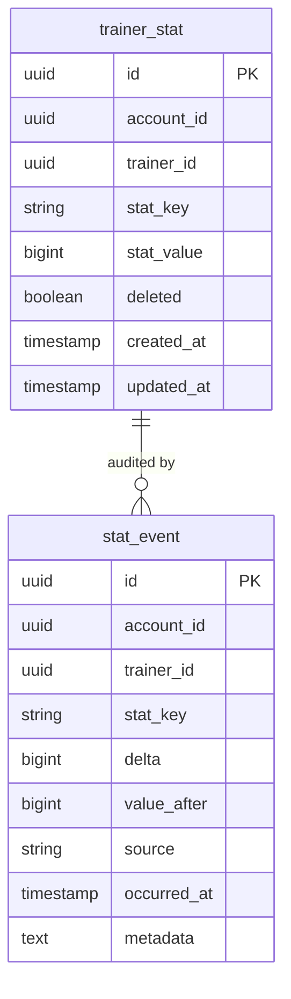

# Stats and Lifetime Tracking

The CR.Stats domain maintains a single flat key-value store of lifetime statistics per trainer. Every meaningful career action — winning a battle, capturing a creature, completing a quest — is recorded as an append-only event and rolled up into an aggregate row. Stats never reset and are never soft-deleted (the event log has no `deleted` column).

## Why This Design?

### Why a String-Keyed Flat Store Instead of Typed Columns?

A typed column per stat (`battles_won INT, damage_dealt_total BIGINT, …`) requires a schema migration whenever a new stat is introduced. A string-keyed row-per-stat design (`(trainer_id, stat_key) → stat_value`) is infinitely extensible — a new domain (achievements, a battle system, a crafting system) can define and write its own stat keys without touching the Stats domain at all. The trade-off is that the key space is untyped and discoverable only via `GetAllAsync`, but in practice the keys are documented constants in `CR.Stats.Data.Constants.StatKey`.

### Why Three Write Operators (Increment / Max / Set)?

Different stats have different semantics:

- **Increment** — cumulative counters that grow forever (`battles_won`, `damage_dealt_total`). Adding instead of replacing is the only correct operation.
- **Max** — personal bests that should only move upward (`highest_creature_level`). A creature levelling down (theoretically impossible today, future-proofed) should not reduce the personal best.
- **Set** — current-state values that represent a snapshot, not an accumulation (`trainer_level`). The Trainer domain calls `SetAsync` on every level-up to replace the previous value.

Mixing operators (e.g. using `Set` for `battles_won`) would silently corrupt data. The constants in `StatKey` document the expected operator for each key.

### When to Use Each Operator

| Use `IncrementAsync` when… | Use `MaxAsync` when… | Use `SetAsync` when… |
|---------------------------|---------------------|---------------------|
| The value always increases monotonically | The value represents a personal best that should never go down | The value is a current snapshot (level, rank) that may go up or down |
| Multiple events each contribute a delta | A single event produces the best result to date | The new value unconditionally replaces the old value |
| Examples: battles won, damage dealt, items collected | Examples: highest creature level, highest score in a run | Examples: trainer level, current rank |

### Why an Append-Only `stat_event` Log?

The event log is a full audit trail with every write's delta, the resulting value, and a `source` label. This enables:

- **Anti-cheat analysis** — detect impossible stat jumps or source patterns that indicate client manipulation
- **Time-series dashboards** — chart trainer progression over time without reprocessing game logs
- **Replay / correction** — if a bug over-increments a stat, the event log shows exactly which events caused it so a targeted correction can be applied

The log is intentionally append-only: `stat_event` has no `deleted` column and rows are never removed.

### Why Does the Stats Domain Have No REST CRUD?

Stats are an internal projection of player behaviour, not a resource the player directly manipulates. The single debug endpoint (`GET /api/v1/stats`) exists only for development inspection. Future consumers (an achievements system, a leaderboard) will inject `IStatService` directly, not go over HTTP.

## Data Model



### `trainer_stat`

| Column | Type | Description |
|--------|------|-------------|
| `id` | UUID | Generated primary key |
| `account_id` | UUID | Owning account |
| `trainer_id` | UUID | Owning trainer |
| `stat_key` | VARCHAR(128) | String key identifying the stat (e.g. `"battles_won"`) |
| `stat_value` | BIGINT | Current aggregated value |
| `deleted` | BOOLEAN | Soft delete (stat rows are rarely deleted; present for schema consistency) |
| `created_at` | TIMESTAMP | Audit trail |
| `updated_at` | TIMESTAMP | Set on every write |

**Unique constraint:** `(trainer_id, stat_key)` — one row per trainer per stat key.

### `stat_event`

| Column | Type | Description |
|--------|------|-------------|
| `id` | UUID | Generated primary key |
| `account_id` | UUID | Owning account |
| `trainer_id` | UUID | Owning trainer |
| `stat_key` | VARCHAR(128) | Which stat was written |
| `delta` | BIGINT | Change applied (positive for Increment/Max/Set; signed for corrections) |
| `value_after` | BIGINT | The `trainer_stat.stat_value` after this write |
| `source` | VARCHAR(64) | Origin label (see Source Values below) |
| `occurred_at` | TIMESTAMP | When the write happened |
| `metadata` | TEXT | JSON blob for context (e.g. `{"questInstanceId": "..."}`) |

`stat_event` has **no `deleted` column** — events are immutable. Do not attempt to soft-delete them.

## Service Interface

Source: `Stats/CR.Stats.Domain.Services/Interface/IStatService.cs`

```csharp
// Read a single stat; returns 0 if the key has never been written
Task<long> GetAsync(Guid accountId, Guid trainerId, string statKey, CancellationToken ct);

// Read all stats for a trainer as a flat dictionary
Task<IReadOnlyDictionary<string, long>> GetAllAsync(Guid accountId, Guid trainerId, CancellationToken ct);

// Add `amount` to current value; creates the row if it doesn't exist
Task IncrementAsync(Guid accountId, Guid trainerId, string statKey, long amount, string source, CancellationToken ct);

// Update only if `value` > current; creates the row if it doesn't exist
Task MaxAsync(Guid accountId, Guid trainerId, string statKey, long value, string source, CancellationToken ct);

// Unconditionally replace with `value`; creates the row if it doesn't exist
Task SetAsync(Guid accountId, Guid trainerId, string statKey, long value, string source, CancellationToken ct);

// Read the audit log for a specific stat (newest first)
Task<IReadOnlyList<StatEvent>> GetStatHistoryAsync(Guid trainerId, string statKey, int limit, CancellationToken ct);
```

The actual `StatService` implementation is a thin pass-through to `IStatRepository`:

```csharp
public class StatService : IStatService
{
    private readonly IStatRepository _repository;
    private readonly ILogger<StatService> _logger;

    public Task IncrementAsync(Guid accountId, Guid trainerId, string statKey,
        long amount, string source, CancellationToken ct = default)
    {
        _logger.LogDebug("IncrementAsync: trainerId={TrainerId} stat={Stat} amount={Amount}",
            trainerId, statKey, amount);
        return _repository.IncrementAsync(accountId, trainerId, statKey, amount, source, ct);
    }
    // … same pattern for MaxAsync, SetAsync, GetAsync, etc.
}
```

Every write method is transactional: the `trainer_stat` upsert and the `stat_event` insert run inside the same database transaction.

## How to Record a Stat from Unity

The intended path is **not** direct HTTP calls to the Stats endpoint — stats are written as a side-effect of quest progress events. The Unity client fires `POST /api/v1/quests/progress` after any game event, and the Quest domain service writes stats as part of that call.

However, if a domain that does not use quests needs to write a stat (e.g., the Trainer domain writing `trainer_level`), it injects `IStatService` and calls it directly server-side. There is no client-facing endpoint for stat writes.

**From the server side (e.g., in a domain service):**

```csharp
// Increment a battle win counter
await _statService.IncrementAsync(
    accountId, trainerId, StatKey.BattlesWon, 1, "battle_result", ct);

// Record a new highest creature level
await _statService.MaxAsync(
    accountId, trainerId, StatKey.HighestCreatureLevel, creature.Level, "quest_progress", ct);

// Record trainer level (current value, not a delta)
await _statService.SetAsync(
    accountId, trainerId, StatKey.TrainerLevel, newLevel, "trainer_level_up", ct);
```

**From Unity (via the quest progress endpoint):**

```bash
# Record a battle win — this writes both quest progress AND the battles_won stat
curl -s -X POST http://localhost:5000/api/v1/quests/progress \
  -H "Authorization: Bearer $TOKEN" \
  -H "Content-Type: application/json" \
  -d '{
    "accountId":     "aaaaaaaa-...",
    "trainerId":     "bbbbbbbb-...",
    "objectiveType": 3,
    "amount":        1,
    "referenceId":   null
  }'
```

The `battles_won` stat is incremented as a side effect of `objectiveType = 3` (`WinBattles`), whether or not any active quest has a `WinBattles` objective.

## How to Query the Audit Log

**Get all current stats for a trainer (debug endpoint):**

```bash
curl -s "http://localhost:5000/api/v1/stats?accountId=$ACCOUNT_ID&trainerId=$TRAINER_ID" \
  -H "Authorization: Bearer $TOKEN" | jq .

# Response:
{
  "battles_won": 5,
  "quests_completed": 2,
  "highest_creature_level": 12,
  "trainer_level": 3,
  "creatures_captured_total": 8,
  "damage_dealt_total": 4200
}
```

**Get the audit history for a specific stat:**

There is no REST endpoint for `GetStatHistoryAsync` currently — it is a repository method exposed for internal use and future admin tooling. To query it directly, access the `stat_event` table:

```sql
-- Postgres
SELECT stat_key, delta, value_after, source, occurred_at, metadata
FROM stat_event
WHERE trainer_id = '<trainer-uuid>'
  AND stat_key = 'battles_won'
ORDER BY occurred_at DESC
LIMIT 20;
```

Sample output:

| stat_key | delta | value_after | source | occurred_at |
|----------|-------|-------------|--------|-------------|
| battles_won | 1 | 5 | quest_progress | 2026-03-13 10:05:00 |
| battles_won | 1 | 4 | quest_progress | 2026-03-13 09:45:00 |
| battles_won | 1 | 3 | quest_progress | 2026-03-13 09:30:00 |

**Detecting suspicious stat jumps:**

```sql
-- Postgres: find any event where delta > 100 for a normally-1-per-event stat
SELECT trainer_id, stat_key, delta, value_after, source, occurred_at
FROM stat_event
WHERE stat_key = 'battles_won'
  AND delta > 100
ORDER BY occurred_at DESC;
```

## Postgres vs SQLite Implementation

**Postgres:** `INSERT INTO trainer_stat ... ON CONFLICT (trainer_id, stat_key) DO UPDATE SET stat_value = ... RETURNING stat_value` — atomic upsert in a single round-trip.

**SQLite:** `INSERT OR IGNORE` followed by `UPDATE` followed by a separate `SELECT stat_value` re-read inside `BeginTransaction()`. SQLite's `RETURNING` clause has limited support across versions, so the value is re-read explicitly.

### Increment vs Max vs Set — database-level logic

**Postgres Increment:**
```sql
INSERT INTO trainer_stat (id, account_id, trainer_id, stat_key, stat_value, ...)
VALUES (@Id, @AccountId, @TrainerId, @StatKey, @Amount, ...)
ON CONFLICT (trainer_id, stat_key)
DO UPDATE SET stat_value = trainer_stat.stat_value + EXCLUDED.stat_value,
              updated_at = NOW()
RETURNING stat_value;
```

**SQLite Increment (within BeginTransaction):**
```sql
INSERT OR IGNORE INTO trainer_stat (id, account_id, trainer_id, stat_key, stat_value, ...)
VALUES (@Id, @AccountId, @TrainerId, @StatKey, 0, ...);

UPDATE trainer_stat SET stat_value = stat_value + @Amount, updated_at = @Now
WHERE trainer_id = @TrainerId AND stat_key = @StatKey;

SELECT stat_value FROM trainer_stat WHERE trainer_id = @TrainerId AND stat_key = @StatKey;
```

**Max** uses `GREATEST(stat_value, EXCLUDED.stat_value)` in Postgres and a `CASE WHEN` update in SQLite.

**Set** is a simple `ON CONFLICT DO UPDATE SET stat_value = EXCLUDED.stat_value`.

## StatKey Constants

Defined in `CR.Stats.Data.Constants.StatKey`. Use these constants rather than inline strings to avoid typos.

| Constant | String Value | Operator | Written By |
|----------|-------------|---------|-----------|
| `BattlesWon` | `"battles_won"` | Increment | `QuestDomainService` on `WinBattles` event |
| `BattlesLost` | `"battles_lost"` | Increment | Battle system (future) |
| `DamageDealtTotal` | `"damage_dealt_total"` | Increment | `QuestDomainService` on `DealDamage` / `DealDamageOfType` events |
| `DamageHealedTotal` | `"damage_healed_total"` | Increment | `QuestDomainService` on `HealAmount` events |
| `CreaturesCapturedTotal` | `"creatures_captured_total"` | Increment | `QuestDomainService` on `CaptureCreature` / `CaptureAnyCreature` events |
| `CreaturesDefeatedTotal` | `"creatures_defeated_total"` | Increment | `QuestDomainService` on `DefeatCreature` / `DefeatAnyCreature` events |
| `ItemsCollectedTotal` | `"items_collected_total"` | Increment | `QuestDomainService` on `CollectItem` events |
| `QuestsCompleted` | `"quests_completed"` | Increment | `QuestDomainService.ClaimRewardsAsync` |
| `HighestCreatureLevel` | `"highest_creature_level"` | Max | `QuestDomainService` on `ReachCreatureLevel` events |
| `TrainerLevel` | `"trainer_level"` | Set | Trainer domain on level-up |
| `CreatureLevelKey(id)` | `"creature_level_{id:N}"` | Max | `QuestDomainService` on `ReachCreatureLevel` events |

`CreatureLevelKey` is a helper method that formats the creature UUID using `{id:N}` (no hyphens) to keep the key short and consistent.

## `source` Field Values

The `source` column on `stat_event` identifies which system produced the write. Standardised values:

| Value | Produced By |
|-------|------------|
| `"quest_progress"` | `QuestDomainService.RecordProgressEventAsync` |
| `"quest_claim"` | `QuestDomainService.ClaimRewardsAsync` |
| `"admin"` | Manual correction via admin tooling |
| `"battle_result"` | Battle system (future) |

When the Stats domain is called from a new context, add a constant string here and document it. Unlabeled sources make audit queries useless.

## Adding a New Stat

1. Add a constant to `CR.Stats.Data.Constants.StatKey`:
   ```csharp
   /// <summary>Total number of items crafted. Use IncrementAsync.</summary>
   public const string ItemsCraftedTotal = "items_crafted_total";
   ```
2. Document the expected write operator in the XML doc comment (as shown above).
3. Call `IStatService` from the appropriate domain service when the event occurs:
   ```csharp
   await _statService.IncrementAsync(accountId, trainerId,
       StatKey.ItemsCraftedTotal, amount, "crafting", ct);
   ```
4. Add a row to the `source` field values table in this doc.

No schema migration is needed — new stat keys are stored as rows in `trainer_stat` and created on first write.

## Dependency Direction

The Stats domain has **no dependency on Quests**. The dependency flows the other way:

```
QuestDomainService   ──►  IStatService  ──►  IStatRepository  ──►  trainer_stat / stat_event
TrainerDomainService ──►  IStatService  (for trainer_level Set on level-up)
BattleSystem (future) ──► IStatService
```

## REST Endpoint

```
GET /api/v1/stats?accountId={accountId}&trainerId={trainerId}
→ 200 OK
{
  "battles_won": 42,
  "quests_completed": 7,
  "highest_creature_level": 18,
  "trainer_level": 5,
  ...
}
```

This endpoint returns the full `Dictionary<string, long>` from `GetAllAsync`. It is a **debug endpoint** — not intended for production client use. Gating it behind an internal/admin role before shipping is recommended.

## DI Registration

```csharp
// Program.cs
builder.Services.AddSingleton<IStatRepository>(
    new StatRepository(statLogger, configuration));

builder.Services.AddScoped<IStatService, StatService>();

if (!isSwaggerGen) new StatDatabaseMigratorPostgres().Migrate(configuration);
```

`IStatRepository` is Singleton (no per-request state). `IStatService` is **Scoped** — it may be injected alongside other Scoped services (notably `QuestDomainService`) in request pipelines.

### Configuration

`appsettings.json` / `config.yml` must include a `StatDatabase` connection string. If the key is absent, migration will throw at startup.

```yaml
# config.yml
StatDatabase: "Host=localhost;Database=cr_stats;Username=...;Password=..."
```

The Stats database can be the same physical Postgres instance as other domains (different schema/tables) or a separate database.

## Common Mistakes

- **Registering `IStatService` as Singleton.** It must be `AddScoped`. The `QuestDomainService` (Scoped) injects it — a Singleton `IStatService` would cause a captured-dependency error. The error manifests as a DI validation exception at startup if `ValidateScopes` is enabled.
- **Omitting `StatDatabase` from configuration.** The migrator runs at startup and will throw a `NullReferenceException` or connection exception immediately if the key is missing.
- **Using `SetAsync` for cumulative counters.** `Set` unconditionally replaces the value. Calling `SetAsync("battles_won", 1)` after `SetAsync("battles_won", 5)` results in `battles_won = 1`. For any stat that should grow over time, use `IncrementAsync`.
- **Reading `stat_event` to get the current stat value.** `stat_event` is an append-only audit log. The current value is in `trainer_stat.stat_value`. Summing `delta` from `stat_event` will give the wrong answer if `MaxAsync` or `SetAsync` was used (those do not write a delta equal to the full new value).
- **Forgetting that `stat_event` has no `deleted` column.** Attempting to soft-delete a stat event will fail at the SQL level. Events are immutable. If a corrective write is needed, issue a new `SetAsync` or `IncrementAsync` with `source = "admin"` and document the correction in `metadata`.
- **Using inline string literals for stat keys.** Always use the `StatKey` constants. A typo in a stat key creates a new phantom stat silently rather than writing to the intended row.
- **Sending `objectiveType` as a string instead of an int from Unity.** The REST endpoint expects the enum's integer value (e.g., `3` for `WinBattles`), not the string name. Check the enum table in the [Quest System](?page=backend/07-quest-system) doc for the integer values.

## Modules and Projects

```
cr-api/Stats/
  CR.Stats.Data/                          ← IStatRepository, IStatService, StatEvent model
  CR.Stats.Data.Constants/                ← StatKey constants
  CR.Stats.Data.Migration/                ← FluentMigrator base migrations
  CR.Stats.Data.Migration.Postgres/       ← Postgres-specific migrator runner
  CR.Stats.Data.Postgres/                 ← PostgreSQL IStatRepository implementation
  CR.Stats.Data.Sqlite/                   ← SQLite IStatRepository implementation
  CR.Stats.Domain.Services/               ← StatService (IStatService implementation)
```

## Related Pages

- [Quest System](?page=backend/07-quest-system) — primary writer of stats via `RecordProgressEventAsync` and `ClaimRewardsAsync`
- [Backend Architecture](?page=backend/01-architecture) — DI registration patterns, repository singleton vs scoped, dual-DB
- [Auth and Accounts](?page=backend/06-auth-and-accounts) — `account_id` / `trainer_id` scoping used on all stat reads and writes
